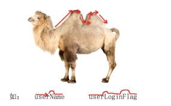

# 1、数据类型

### 1.1 编程规范

#### 注释

python注释也有自己的规范，在文章中会介绍到。注释可以起到一个备注的作用，团队合作的时候，个人编写的代码经常会被多人调用，为了让别人能更容易理解代码的通途，使用注释是非常有效的。

在说规范之前我们有必要先看以下Python的注释有哪些 ?

- 单行注释
- 多行注释

**单行注释** 

以 `#` 开头，`#` 右边的所有东西都被当做说明文字，而不是真正要执行的程序，只起到辅助说明作用

示例代码如下：

```python
# 这是第一个单行注释
print("hello python")
```

> 为了保证代码的可读性，`#` 后面建议先添加一个空格，然后再编写相应的说明文字

**多行注释（块注释）**

如果注释信息很多，一行无法显示，就可以使用多行注释

要在 Python 程序中使用多行注释，可以用一对连续的 三个 引号(单引号和双引号都可以)

示例代码如下：

```python
"""
这是一个多行注释

在多行注释之间，可以写很多很多的内容……
""" 
print("hello python")
```

> 注释不是越多越好，对于一目了然的代码，不需要添加注释

#### 标识符命名规则

开发人员在程序中自定义的一些符号和名称。标识符是自己定义的, 如变量名 、函数名等

标识符由字母、下划线和数字组成，且数字不能开头

python中的标识符是区分大小写的

##### 命名规则

**1、下滑线命名法**

用下划线“_”来连接所有的单词，比如 hello_world

1. 见名知意

2. 起一个有意义的名字，尽量做到看一眼就知道是什么意思(提高代码可读性) 比如: 名字 就定义为 name , 定义学生 用 student

**2、驼峰命名法** 

大驼峰式命名法（upper camel case）：

- 每一个单字的首字母都采用大写字母，

  例如：FirstName、HelloWorld

小驼峰式命名法（lower camel case）：

+ 第一个单词以小写字母开始；

+ 第二个单词的首字母大写，

  例如：helloWorld、firstName



**注意**

所有的变量名、函数名 都是用下划线命名法

类名使用大驼峰命名法


##### python命名规则

- python中的标识符是区分大小写的
  
- 变量、函数名全部用小写与下划线
- 常量（配置文件变量、不修改的变量）全部用大写
- 类名用大驼峰命名法

**案例： 命名规范查看** 

```python
# 类名用大驼峰 类与其他内容用两个换行隔开
class Student(object):

    # 变量名之间用空格隔开
    def __init__(self, hello):
        self.hello = hello

    # 函数与函数之间加换行
    def print_hello_world(self):
        """
        函数名用下划线命名法
        尽量满足见名知意
        """
        print(f"hello.jpg {self.hello} !")

    def PrintHelloWorld(self):
        """大驼峰命名法提示有问题"""
        print(f"hello.jpg {self.hello} !")

    def printHelloWorld(self):
        """小驼峰命名法提示有问题"""
        print(f"hello.jpg {self.hello} !")

    def printhelloworld(self):
        """直接写很难读懂"""
        print(f"hello.jpg {self.hello} !")

    def PRINTHELLOWORLD(self):
        """直接写很难读懂"""
        print(f"hello.jpg {self.hello} !")


"""团队规范"""
# 变量名使用下划线命名法
# 尽量满足见名知意
# 对象也是变量
student = Student("world")
student.print_hello_world()
```


##### 关于代码规范

- `Python` 官方提供有一系列 PEP（Python Enhancement Proposals） 文档
- 其中第 8 篇文档专门针对 **Python 的代码格式** 给出了建议，也就是俗称的 **PEP 8**
- 文档地址：https://www.python.org/dev/peps/pep-0008/
- 谷歌有对应的中文文档：https://zh-google-styleguide.readthedocs.io/en/latest/google-python-styleguide/python_style_rules/

> 任何语言的程序员，编写出符合规范的代码，是开始程序生涯的第一步


##### 编程习惯的重要性

1. 可以方便排查错误
2. 方便自己看的代码
3. 便于别人看懂你的代码（团队协作）

良好的编程习惯的养成不能靠说，要靠多练，要在大量的编程中将其融入骨髓中。

一套系统应该具有统一的编程风格，任何编程风格都不可能是完美，应该从可维护性、可读性方面继续保持一种编程风格，而不要将多种编程风格混合在一套系统中，对于新手，难以理解如此多种风格的编码。

> ctrl + alt + l 快速格式化代码


#### 输入输出与变量

##### 输出

**print()** 方法用于打印输出，最常见的一个函数。

以下是 print() 方法的语法:

```python
print(*objects, sep=' ', end='\n', file=sys.stdout)
```

**参数**

- `objects` -- 复数，表示可以一次输出多个对象。输出多个对象时，用分隔符分割。
- `sep` -- 用来间隔多个对象，默认值是一个空格。
- `end` -- 用来设定以什么结尾。默认值是换行符 \n，我们可以换成其他字符串。
- `file` -- 要写入的文件对象。


##### 输入

input() 函数接受一个标准输入数据，返回为 string 类型。

```python
>>>a = input("input:")
input:123                  # 输入整数
>>> type(a)
<class 'str'>              # 字符串
```


##### 变量

> 程序就是用来处理数据的，而变量就是用来存储数据的

- 在 Python 中，每个变量在使用前都必须赋值，变量赋值以后该变量才会被创建
- 等号（=）用来给变量赋值
  - `=` 左边是一个变量名
  - `=` 右边是存储在变量中的值
- 直接使用之前已经定义的变量
- 变量名只有在 **第一次出现** 才是 **定义变量**
- 变量名再次出现，不是定义变量，而是直接使用之前定义过的变量
- 在程序开发中，可以修改之前定义变量中保存的值吗？
  - 可以
  - 变量中存储的值，就是可以 **变** 的

```python
变量名 = 值
```

> 变量定义之后，后续就可以直接使用了 


### 1.2 数值类型

#### int(整型)

> 在 `Python` 中定义变量是 **不需要指定类型**（在其他很多高级语言中都需要）

型，也被称之为整数。整数就是数学中的数字。

整型在Python中不受长度限制大小范围


> 使用 `type` 函数可以查看一个变量的类型

```python
In [1]: 1
Out[1]: 1

In [2]: type(1)
Out[2]: int
```


#### 浮点型（float）

小数类型

> 小数

```python
In [1]: 1.0
Out[1]: 1.0

In [2]: type(1.0)
Out[2]: float
```

运算、运算符优先级与整型是一样。


#### 类型转化

浮点数转化为整型（显示转化）

```python
In [3]: int(1.0)
Out[3]: 1

In [4]: float(1)
Out[4]: 1.0
```

隐式转化，系统背后默认进行转换

```python
In [5]: 1/2
Out[5]: 0.5
```


### 1.3 字符串

> 字符串是一种不可变的序列类型

#### 字符串创建

字符串是 Python 中最常用的数据类型。我们可以使用引号( **'** 或 **"** )来创建字符串。

创建字符串很简单，只要为变量分配一个值即可。

**单引号和双引号** 

在 `Python` 中我们都知道单引号和双引号都可以用来表示一个字符串，比如

```python
print("What's your name?")

结果:
"What's your name?"

print('"python"是一门优秀的语言')

结果:
"python"是一门优秀的语言

一个单引号并不是单引号，它是字符串创建的格式
```

总体来说没有任何区别，只在单引号当普通字符时容易区分：如 var = "let's go"


 **三引号创建块字符串** 长字符串

```python
# 三引号实现块注释
""" 文档注释
三引号实现块注释
"""
''''''
```


#### 字符串格式化

> 把不是字符类型的 转变成字符串

在 Python 中可以使用 `print` 函数将信息输出到控制台

如果希望输出文字信息的同时，**一起输出** **数据**，就需要使用到 **格式化操作符** 

##### **format** 


此函数可以快速的处理各种字符串，增强了字符串格式化的功能。基本语法是使用{}和：来替代%

```python
name = '张三'
age = 18
nickname = '法外狂徒'


# format 用 {} 占位
print('姓名：{}，年龄{}，外号：{} '.format(name, age, nickname))
print('hello {} 你今年已经{}岁了'.format(name, age))
```


```python
# 保留小数点后两位
In [1]: '{:.2f}'.format(12.333)
Out[1]: '12.33'

In [2]: '{a:.2f}'.format(a=12.333)
Out[2]: '12.33'

In [3]: '{a:6.2f}'.format(a=12.333)
Out[3]: ' 12.33'
```


##### %s

`%` 被称为 **格式化操作符**，专门用于处理字符串中的格式

- 包含 `%` 的字符串，被称为 **格式化字符串** 
- `%` 和不同的 **字符** 连用，**不同类型的数据** 需要使用 **不同的格式化字符** 

| 格式化字符 | 含义                                                         |
| ---------- | ------------------------------------------------------------ |
| %s         | 字符串                                                       |
| %d         | 有符号十进制整数，`%06d` 表示输出的整数显示位数，不足的地方使用 `0` 补全 |
| %f         | 浮点数，`%.2f` 表示小数点后只显示两位                        |
| %%         | 输出 `%`                                                     |

语法格式如下：

```python
print("格式化字符串 %s" % 变量1)

print("格式化字符串" % (变量1, 变量2...))
```

```python
name = '张三'
age = 18
nickname = '法外狂徒'

name2 = '李四'
age2 = 19
nickname2 = '帮凶'

# %s 用 %s 占位
print('姓名：%s' % name)
# 多个参数
print('%s，%s 哦嗨呦' % (name, name2))
```


| 格式化字符 | 含义                                                         |
| ---------- | ------------------------------------------------------------ |
| %s         | 字符串                                                       |
| %d         | 有符号十进制整数，`%06d` 表示输出的整数显示位数，不足的地方使用 `0` 补全 |
| %f         | 浮点数，`%.2f` 表示小数点后只显示两位                        |
| %%         | 输出 `%`                                                     |
| %c         | %ASCII字符                                                   |
| %o         | %8进制                                                       |
| %x         | %16进制                                                      |
| %e         | %科学计数法                                                  |


##### **f** 

f’{}'形式，并不是真正的字符串常量，而是一个运算求值表达式，可以很方便的用于字符串拼接、路径拼接等

```python
name = '张三'

# f 在字符串中嵌入变量
print(f'hello {name} !')
```

#### 案例：猫眼top100网址

猫眼top100的网址有以下特点：

	第一页：https://maoyan.com/board/4?offset=0
	
	第二页：https://maoyan.com/board/4?offset=10
	
	第三页：https://maoyan.com/board/4?offset=20
	
	....
	
	第十页：https://maoyan.com/board/4?offset=90

请分别使用三种字符串构建的方法创建所有的请求地址


### 1.4 字符串常用方法

字符串是不可变数据类型，所有的操作都是返回新的一个列表，不会修改原有列表

 **字符串** 能够使用的 **方法** 如下：

```
In [1]: hello_str.
hello_str.capitalize    hello_str.isidentifier  hello_str.rindex
hello_str.casefold      hello_str.islower       hello_str.rjust
hello_str.center        hello_str.isnumeric     hello_str.rpartition
hello_str.count         hello_str.isprintable   hello_str.rsplit
hello_str.encode        hello_str.isspace       hello_str.rstrip
hello_str.endswith      hello_str.istitle       hello_str.split
hello_str.expandtabs    hello_str.isupper       hello_str.splitlines
hello_str.find          hello_str.join          hello_str.startswith
hello_str.format        hello_str.ljust         hello_str.strip
hello_str.format_map    hello_str.lower         hello_str.swapcase
hello_str.index         hello_str.lstrip        hello_str.title
hello_str.isalnum       hello_str.maketrans     hello_str.translate
hello_str.isalpha       hello_str.partition     hello_str.upper
hello_str.isdecimal     hello_str.replace       hello_str.zfill
hello_str.isdigit       hello_str.rfind
```

> 提示：正是因为 python 内置提供的方法足够多，才使得在开发时，能够针对字符串进行更加灵活的操作！应对更多的开发需求！

#### 查找和替换 

| 方法                             | 用法                                                  |
| -------------------------------- | ----------------------------------------------------- |
| string.strip()                   | 默认去掉 string 左右两边的空白字符                    |
| string.replace(old_str, new_str) | 把 string 中的 old_str 替换成 new_str                 |
| string.split()                   | 默认以空白字符进行分割                                |
| string.join(seq)                 | 将 seq 中所有的元素（字符串类型）合并为一个新的字符串 |

#### 提问：如何改变字符串

将下面的字符串中 world 改成 Python

```
hello = "hello world !"

print(hello.replace('world', 'Python'))

print(hello)
```

字符串是一种不可变的数据类型。所有操作字符的方法都是返回一个新的字符串。可以用返回的新的字符串覆盖掉之前的字符串。

#### 转义字符

在需要在字符中使用特殊字符时，python 用反斜杠转义字符。如下表：

| 转义字符 | 描述                                         |
| :------- | :------------------------------------------- |
| \        | (在行尾时)续行符                             |
| \\       | 反斜杠符号                                   |
| `\'`     | 单引号                                       |
| `\"`     | 双引号                                       |
| \a       | 响铃                                         |
| \b       | 退格(Backspace)                              |
| \e       | 转义                                         |
| \000     | 空                                           |
| \n       | 换行                                         |
| \v       | 纵向制表符                                   |
| \t       | 横向制表符                                   |
| \r       | 回车                                         |
| \f       | 换页                                         |
| \oyy     | 八进制数，yy代表的字符，例如：\o12代表换行   |
| \xyy     | 十六进制数，yy代表的字符，例如：\x0a代表换行 |
| \other   | 其它的字符以普通格式输出                     |

#### 原始字符串

由于字符串中的反斜线都有特殊的作用，因此当字符串中包含反斜线时，就需要使用转义字符 \ 对字符串中包含的每个 '\' 进行转义。

比如说，我们要写一个关于 Windows 路径 `G:\publish\codes\02\2.4` 这样的字符串，如果在 Python 程序中直接这样写肯定是不行的，需要使用 \ 转义字符，对字符串中每个 '\' 进行转义，即写成 `G:\\publish\\codes\\02\\2.4 `这种形式才行。

有没有觉得这种写法很啰嗦，有没有更好的解决办法呢？答案是肯定的，借助于原始字符串可以很好地解决这个问题。

原始字符串以“r”开头，它不会把反斜线当成特殊字符。因此，上面的 Windows 路径可直接写成如下这种形式：  

```
# 原始字符串包含的引号，同样需要转义
s2 = r'"Let\'s go", said Charlie'
print(s2)
```


### 1.5 布尔类型(bool)

python 中布尔值使用常量 True 和 False来表示；注意大小写

`bool` 是 `int` 的子类（继承 `int` ），故 `True == 1  False == 0` 是会返回 `Ture` 

`bool` 类型只有两种状态真或假

```python
In [17]: bool(-1)
Out[17]: True

In [18]: bool(0)
Out[18]: False

In [19]: bool(None)
Out[19]: False

In [20]: bool("")
Out[20]: False

In [21]: bool(" ")
Out[21]: True

In [22]: def a():
    ...:     pass
    ...:
    ...: bool(a)
Out[22]: True
```

**总结**

True 对 False 错

布尔类型只有两种状态，`True` or `Flase` 。数字除了零之外，其余均为 `True` ，字符串除了空字符串之外都为`True`，对象除了空对象之外，其余均为 `True` 。

默认情况下，所有类型都可以转化为布尔类型


### 1.6 运算符

#### 算数运算符

因为是整数，所以也可以进行数学中的基本运算。

- 算数运算符是 **运算符的一种** 
- 是完成基本的算术运算使用的符号，用来处理四则运算

| 运算符 |  描述  | 实例                                       |
| :----: | :----: | ------------------------------------------ |
|   +    |   加   | 10 + 20 = 30                               |
|   -    |   减   | 10 - 20 = 10                               |
|   *    |   乘   | 10 * 20 = 200                              |
|   /    |   除   | 10 / 20 = 0.5                              |
|   //   | 取整除 | 返回除法的整数部分（商） 9 // 2 输出结果 4 |
|   %    | 取余数 | 返回除法的余数 9 % 2 = 1                   |
|   **   |   幂   | 又称次方、乘方，2 ** 3 = 8                 |

```python
# 取余
In [16]: 9 % 4
Out[16]: 1

In [17]: 9 % 3
Out[17]: 0
    
In [18]: 2 ** 3
Out[18]: 8
```

除此之外，“+”还可以作为字符串（包括后续要介绍的序列）的连接运算符。

```python
s1 = 'Hello, '
s2 = 'Charlie'
# 使用+连接两个字符串
print(s1 + s2)
```

**算数运算符的优先级** 

和数学中的运算符的优先级一致，在 Python 中进行数学计算时，同样也是：
- **先乘除后加减** 
- 同级运算符是 **从左至右** 计算
- 可以使用 `()` 调整计算的优先级

以下表格的算数优先级由高到最低顺序排列

| 运算符   | 描述                   |
| -------- | ---------------------- |
| **       | 幂 (最高优先级)        |
| * / % // | 乘、除、取余数、取整除 |
| + -      | 加法、减法             |

例如：
- `2 + 3 * 5 = 17`
- `(2 + 3) * 5 = 25`
- `2 * 3 + 5 = 11`
- `2 * (3 + 5) = 16` 


#### 赋值运算符

以下假设变量a为10，变量b为20：

| 运算符 | 描述             | 实例                                  |
| ------ | ---------------- | ------------------------------------- |
| =      | 简单的赋值运算符 | c = a + b 将 a + b 的运算结果赋值为 c |
| +=     | 加法赋值运算符   | c += a 等效于 c = c + a               |
| -=     | 减法赋值运算符   | c -= a 等效于 c = c - a               |
| *=     | 乘法赋值运算符   | c *= a 等效于 c = c * a               |
| /=     | 除法赋值运算符   | c /= a 等效于 c = c / a               |
| %=     | 取模赋值运算符   | c %= a 等效于 c = c % a               |
| **=    | 幂赋值运算符     | `c **= a 等效于 c = c ** a`           |
| //=    | 取整除赋值运算符 | c //= a 等效于 c = c // a             |


#### 比较运算符

| 比较运算符 | 功能                                                         |
| ---------- | ------------------------------------------------------------ |
| >          | 大于，如果运算符前面的值大于后面的值，则返回 True；否则返回 False |
| >=         | 大于或等于，如果运算符前面的值大于或等于后面的值，则返回 True；否则返回 False |
| <          | 小于，如果运算符前面的值小于后面的值，则返回 True；否则返回 False |
| <=         | 小于或等于，如果运算符前面的值小于或等于后面的值，则返回 True；否则返回 False |
| ==         | 等于，如果运算符前面的值等于后面的值，则返回 True；否则返回 False |
| !=         | 不等于，如果运算符前面的值不等于后面的值，则返回 True；否则返回 False |


#### 逻辑运算符

Python语言支持逻辑运算符，以下假设变量 a 为 10, b为 20:

| 运算符 | 逻辑表达式 | 描述                         | 实例                    |
| ------ | ---------- | ---------------------------- | ----------------------- |
| and    | x and y    | 布尔"与" ，两个条件都满足    | (a and b) 返回 20。     |
| or     | x or y     | 布尔"或"，两个条件中满足一个 | (a or b) 返回 10。      |
| not    | not x      | 布尔"非" ，否定之前的结果    | not(a and b) 返回 False |

逻辑运算符案例：

```python
x = 1
y = 0

print(x and y)
print(x or y)
print(not x)
print(not y)

# 案例升级
x = 3 > 4
y = 5 > 4
```


#### 运算符优先级

以下表格列出了从最高到最低优先级的所有运算符：

| 运算符                   | 描述                 |
| ------------------------ | -------------------- |
| **                       | 指数 (最高优先级)    |
| * / % //                 | 乘，除，取模和取整除 |
| <= < > >=                | 比较运算符           |
| <> == !=                 | 等于运算符           |
| = %= /= //= -= += *= **= | 赋值运算符           |
| is is not                | 身份运算符           |
| in not in                | 成员运算符           |
| not and or               | 逻辑运算符           |


#### 案例：运算符优先级

```python
r = 4 > 2 ** 4 or True is 1 and '4' in "345"
if r:
    print('猜猜我的结果', r)
else:
    print('猜猜我的结果', r)

```


### 1.7 总结

1、在演练中，一共有几种数据类型？

- 4 种
- `str` —— 字符串
- `bool` —— 布尔（真假）
- `int` —— 整数
- `float` —— 浮点数（小数）


2、在 `Python` 中定义变量时需要指定类型吗？

- 不需要
- `Python` 可以根据 `=` 等号右侧的值，自动推导出变量中存储数据的类型

1. 字符串是一种什么结构？它能不能被修改？
   - 字符串是一种序列类型
   - 字符串不能被修改


### 1.8 拓展知识

#### 常见错误类型

```python
SyntaxError: unexpected EOF while parsing 
语法错误，多了无法解析的符号，检查一下是否多了或者少了括号

SyntaxError: invalid character in identifier 
语法错误有无效标识符，检查一下中文符号

IndexError: list index out of range 
索引错误，超出索引范围，检查一下列表是否为空

TypeError: must be str, not int
数据类型错误，该数据不是正确的数据类型，比如字符串和数字直接拼接，检查一下数据类型

IndentationError: expected an indented block
缩进错误，检查一下代码的缩进是否正确

KeyError: 'fond'
键错误，字典中没有该的key对应的值，检查一下键名或者字典数据是否正确

ValueError: substring not found
值错误，输入的数据类型跟要求的不符合

NameError: name 'a' is not defined
未初始化对象，变量没有被定义

AttributeError: 'tuple' object has no attribute 'remove'
属性错误，该对象没有这个属性、方法，检查一下数据类型

SystemExit   
解释器请求退出，出现在exit()函数后

IOError 
输入/输出操作失败

ImportError 
导入模块/对象失败，检查一下模块是否能够正常使用

UnicodeDecodeError/UnicodeEncodeError/UnicodeTranslateError
Unicode 解码/编码/转换/时的错误
```


#### 成员运算符

`in` 和 `not in` 被称为 **成员运算符** 

成员运算符用于 **测试** 序列中是否包含指定的 **成员** 

| 运算符 | 描述                                                  | 实例                          |
| ------ | ----------------------------------------------------- | ----------------------------- |
| in     | 如果在指定的序列中找到值返回 True，否则返回 False     | `3 in '123'` 返回 `True`      |
| not in | 如果在指定的序列中没有找到值返回 True，否则返回 False | `3 not in '123'` 返回 `False` |


#### 身份运算符

> is 比较的是**两个实例对象是不是完全相同，它们是不是同一个对象，占用的内存地址是否相同**。莱布尼茨说过：“世界上没有两片完全相同的叶子”，这个is正是这样的比较，比较是不是同一片叶子（即比较的id是否相同，这id类似于人的身份证标识）。

身份运算符用于比较两个对象的存储单元

| 运算符 | 描述                                        | 实例                                                         |
| ------ | ------------------------------------------- | ------------------------------------------------------------ |
| is     | is 是判断两个标识符是不是引用自一个对象     | **x is y**, 类似 **id(x) == id(y)** , 如果引用的是同一个对象则返回 True，否则返回 False |
| is not | is not 是判断两个标识符是不是引用自不同对象 | **x is not y** ， 类似 **id(a) != id(b)**。如果引用的不是同一个对象则返回结果 True，否则返回 False。 |

> id() 函数用于获取对象内存地址。

身份运算符案例：

```python
# %% 身份运算符
one = 1
o = 1
print(o is one)  # 变量驻存在内存中

a1 = [1]
a2 = [1]

print(a1 is a2)

print(id(o), id(one))
print(id(a1), id(a2))

# is 与 ==

print(a1 is a2)
print(a1 == a2)
```


#### 字符串格式化

```python
# 保留小数点后两位
In [1]: '{:.2f}'.format(12.333)
Out[1]: '12.33'

In [2]: '{a:.2f}'.format(a=12.333)
Out[2]: '12.33'
```

