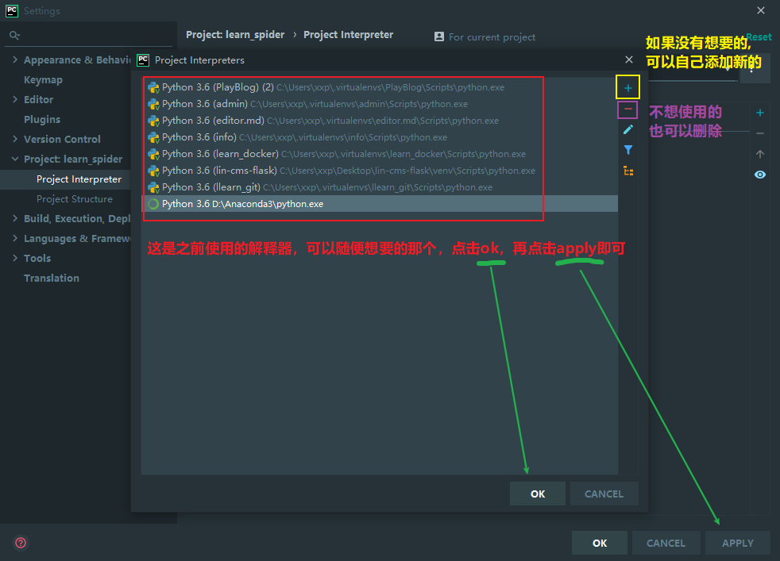

# 一、安装解释器

## 1、1 介绍解释器

​		解释器（英语：Interpreter），是一种电脑程序，能够把高级编程语言一行一行直接转译成机器能够读懂的二进制的数据，然后交给机器运行的程序。

​		python 解释器是用 C 语言开发的，也叫 CPython 。在命令行下运行 python 就是启动 CPython 解释器。CPython 是使用最广的 Python 解释器。教程的所有代码也都在CPython 下执行。

## 1、2 下载解释器

学习python使用广泛的解释器类型主要有两种：

1. 官方解释器
2. Conda
   - [ ] Anaconda
   - [x] Miniconda <推荐>

推荐大家安装 `Miniconda` ，`Miniconda`是一款小巧的python环境管理工具，其安装程序中包含conda软件包管理器和Python。一旦安装了`Miniconda`，就可以使用`conda`命令安装任何其他软件工具包并创建环境，包括`pip`包管理工具在Miniconda中也是内置的。

**Miniconda解释器下载地址：** https://docs.conda.io/en/latest/miniconda.html

**注意：**下载地址网页是在国外，默认国内访问与下载速度都会非常慢，如果不想等待可以在以下链接下载

蓝凑云链接：https://wwae.lanzoub.com/iikmr15gvo0d    密码:2wa6

在下载地址的网页中下载自己系统所对应的安装包，本教程以**Windows**系统为例子进行说明。

首先在下载页面下拉找到Windows系统安装包，下载**Python 3.10** 的解释器版本


注意：解释器并不是越新越好，做项目最需要的稳定、稳定、稳定！！！新版本解释器往往意味着不兼容，会有比较多的 bug 以及很多第三方库无法使用。在这里我推荐采用比最新版解释器低 1到 2 个版本的，除了很久之前的项目，否则也不推荐使用老版本的解释器，原因与最新版的解释器问题差不多。

## 1、3 安装解释器

Python 解释器在电脑中可以存在多个，新手往往不能区分解释器环境会导致各种问题。所以在安装之前需要检查之前是否有安装过，如果只安装过一个并且版本是你需要的，那就可以跳过这一环节。

如果不能区分安装过多少个解释器，并且环境使用起来有问题，那么推荐删除完之后再进行安装。

### 1、3、1 删除电脑中旧的解释器

**检查命令行窗口**

首先在开始菜单搜索打开命令提示符


在窗口里面输入 python 如果出现了 python 字符就说明进入了 python shell 的命令行，然后可以看到 Python 解释的版本。如果版本不对的话就需要删除安装。

注意：可以使用 win + r 快捷键输入 cmd 进入 命令行窗口

.png)

如果什么都没有出现，或者是弹出 windows 系统的微软商店，则说明没有解释器。

**检查系统软件（删除解释器）**

注意：如果之前没有安装过 python 解释器是不需要进入这一环节。

首先进入 windows 的系统设置，点击应用

提示：可以通过 win + i 的快捷键进入


之后就需要检查系统中是否安装过 python 解释器，如果有安装过的就需要删除一下。

注意：如果安装过 Anaconda 也需要删除，没有安装过的跳过。

.png)

删除完了之后可以重新进入命令行窗口检查一下 python 解释器是否存在，输入 python 之后没有反应则说明已经成功删除了。

### 1、3、2 安装解释器

下载好解释器之后，双击软件就可以进行安装。双击之后会出现下图。点击下一步。


点击下一步，表示同意使用协议


点击 Just Me，表示仅为当前计算机用户安装，然后点击 Next


注意：不要选择 All Users ，因为后续无法自动配置环境变量


选择安装位置，点击下一步


注意：不要装系统盘C盘，因为后续会有文件权限问题


勾选自动添加环境变量选项，点击Install安装。等待两分钟即可安装成功。


点击Next


取消接下来的两个选项，不取消会自动在浏览器弹出Miniconda页面。然后点击 Finish ，即可成功安装


安装好之后可以在 cmd 窗口中检查


可以看到解释器版本已经变为 python 3.10.10 说明已经安装成功了。


# 二、Pycharm编辑器安装

## 集成开发环境

集成开发环境（IDE，Integrated Development Environment ）是用于提供程序开发环境的应用程序，一般包括代码编辑器、编译器、调试器和图形用户界面等工具。集成了代码编写功能、分析功能、编译功能、调试功能等一体化的开发软件服务套。所有具备这一特性的软件或者软件套都可以叫集成开发环境。

集成开发环境可以使程序员开发代码变的更加轻松。

### Pychram

PyCharm是一种 Python IDE，带有一整套可以帮助用户在使用Python语言开发时提高其效率的工具，比如调试、语法高亮、Project管理、代码跳转、智能提示、自动完成、单元测试、版本控制。此外，该IDE提供了一些高级功能，以用于支持Django框架下的专业Web开发。

Pychram 分为专业版与社区版本。社区办相比专业版缺少数据库、远程开发、版本控制、项目开发等高级功能，足以满足日常开发，但是服务应付大型项目开发需求。推荐使用专业版。

### VS code

全程是 Visual Studio Code ， (简称 VS Code ) 是一款免费开源的现代化轻量级代码编辑器，支持语法高亮、智能代码补全、自定义热键、括号匹配、代码片段、代码对比等特性，并针对网页开发和云端应用开发做了优化。

VS Code 主要用于前端开发，用来开发 Python 代码需要配置很多东西，会麻烦一些。


## 下载编辑器

Pycharm 分为两个版本，一个是社区版，一个为专业版。如果不用到数据库与做全栈项目开发，使用社区版也是够了。

注意：Pycharm 的官网在国外，默认国内访问与下载速度都会比较慢，如果不想等待可以查看最后附录中的下载方式。

注意：windows 下载直链 https://download-cdn.jetbrains.com/python/pycharm-professional-2022.3.3.exe

不会选择版本的请点击上面的链接直接下载！！！

不会选择版本的请点击上面的链接直接下载！！！

不会选择版本的请点击上面的链接直接下载！！！

首先访问 https://www.jetbrains.com/zh-cn/pycharm/ 然后点击下载，进入下载页

或者直接选的版本进行下载： https://www.jetbrains.com/zh-cn/pycharm/download/other.html


默认是中文的，可以在其他版本中选择对于的版本，也可以下拉选择对应的操作系统，然后点击下载就可以了。

注意：一定要选择好对应的版本，不然用起来的时候会遇到麻烦。

## 安装编辑器

在安装编辑的时候需要注意一下，如果之前安装过旧版本的 pycahrm 专业版最好是提前删除。如果安装过社区版的话，则不影响专业版的安装，这两个版本是可以共存的。

提示

安装之前最好先把 pycharm 删除干净，不然可能会影响新编辑器的使用。

安装的时候一路默认安装即可，什么都不用操作。安装好了之后再进行激活。

## 激活工具

**激活步骤：**

* 安装好Pycharm后，双击运行Pycharm，会提示需要激活，此时即可关闭Pycharm
* 在下方链接下载windows系统破解工具
* windows下载之后解压压缩文件双击PyCharm激活.vbs文件即可激活

一定要解压一定要解压一定要解压


**破解工具下载链接：**

- Windows： https://wwxs.lanzoum.com/iLu4p0qsimxi
- Mac： https://wwxs.lanzoum.com/i6As40qsimwh
- Linux： https://wwxs.lanzoum.com/i6LKt0qsimuf

## 推荐插件

插件功能可以按照上课时候老师推荐的时候安装， 以下插件非必要：

- 汉化插件： Chinese (Simplified) Language Pack / 中文语言包
- 主题插件： Material Theme UI
- 翻译插件： Translation
- 代码提示插件： Tabnine AI Code Completion- JS Java Python TS Rust Go PHP & More

可以到官方的插件市场进行下载安装： https://plugins.jetbrains.com/

**离线安装包**

- 汉化插件： https://wwxs.lanzoum.com/iTMEI0r1i78h
- 主题插件： https://wwxs.lanzoum.com/i1JbA0r1i5re
- 翻译插件： https://wwxs.lanzoum.com/ifnHx0qsmppc
- 代码提示插件： https://wwxs.lanzoum.com/iLe3k0qsmpsf


# 三、Pycharm配置解释器

先点击file，再点击setting


然后再修改解释器，如果默认没有解释器，就需要自己设置


**修改解释器**

如果没有设置解释器，或者是想修改解释器。就点击解释器的向下箭头，选择 show all


接下来选择我不使用默认的, 而是去添加一个新的解释器.



例如我想要用python2.7的环境运行这个代码,恰好我电脑的磁盘中.先点击 +然后一路点击ok,后面就出现了一个新的解释器


然后点击应用就可以了


# 四、pip换源

## 为什么要换源

由于国内通过 pip 下载 python 包的速度真的很慢，特别是下载包文件比较大的情况下经常会导致下载失败，把默认的 PyPi 源切换化为国内源 tuna, douban, aliyun 从而可以加快 python 包的安装速度。

pip国内的一些镜像

- https://pypi.tuna.tsinghua.edu.cn/simple    清华大学（完全度和速度都很好，是一个优秀的pip镜像源）
- http://mirrors.aliyun.com/pypi/simple/     阿里云（完全度和速度也很好，是一个不错的选择）
- https://pypi.douban.com/simple/     是豆瓣提供一个镜像源，软件够新，连接速度也很好。

## 修改源方法：

### windows

打开C盘，进入个人用户目录


然后新建一个pip文件夹


进入文件夹，新建一个 pip.ini 的文件


如果没有齿轮，请先打开可以查看文件后缀名


然后用记事本或者是notepad++打开这个文件，往里面写入

```
[global]
index-url = https://pypi.tuna.tsinghua.edu.cn/simple

[install]
trusted-host = pypi.tuna.tsinghua.edu.cn
```


到此为止，pip的源就修改好了。

### Mac / Linux

首先进入终端页面

先切换到家目录：cd ~/

然后创建 pip 的配置文件夹：mkdir .pip

再写换到 pip 配置文件夹：cd .pip

创建一个配置文件：nano pip.conf

然后把配置文件拷贝进去，保存即可生效