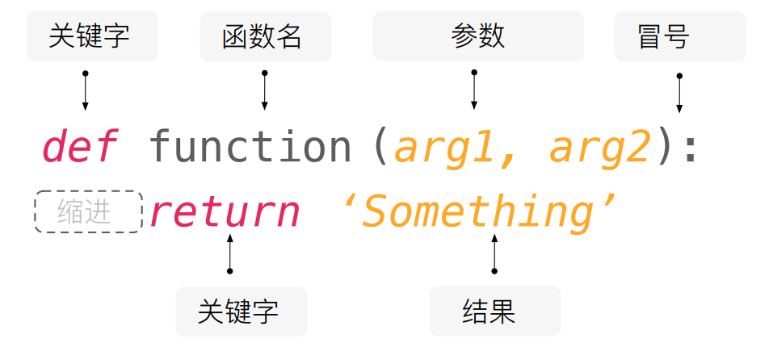

## 5 函数

到目前为止，我们的 Python 代码已经实现了小的分块。它们都适合处理微小任务，但是我们想复用这些代码，所以需要把大型代码组织成可管理的代码段。代码复用的第一步是使用函数，它是命名的用于区分的代码段。函数可以接受任何数字或者其他类型的输入作为参数，并且返回数字或者其他类型的结果。

### 5.1 简单函数

函数：就是**封装了一段可被重复调用执行的代码块**。通过此代码块可以**实现大量代码的重复使用**。  

函数的使用包含两个步骤：

1. 定义函数 —— **封装** 独立的功能
2. 调用函数 —— 享受 **封装** 的成果

函数的作用，在开发程序时，使用函数可以提高编写的效率以及代码的重用


#### 函数的定义




##### 声明函数

1. `def` ：表示函数的关键字，是英文 `define` 的缩写
2. 函数名：函数的名称，后续根据函数名调用函数，函数名称应该能够表达函数封装代码的功能
3. `arg`  : 即 argument 参数
4. 函数体：函数中进行一系列的逻辑计算，如：发送邮件、计算出 [11,22,38,888,2]中的最大数等...
5. 函数名称的命名应该符合标识符的命名规则
   - 可以由 字母、下划线和数字组成
   - 不能以数字开头
   - 不能与关键字重名

```python
# 声明函数
def func():
    # 函数体代码
    # 函数体代码
    # 函数体代码
    # 函数体代码
    print()

```

def 是声明函数的关键字,必须小写

由于函数一般是为了实现某个功能才定义的， 所以通常我们将函数名命名为动词，比如 get_sum


#####  调用函数

```python
# 调用函数
函数名();  # 通过调用函数名来执行函数体代码
```

调用的时候千万不要忘记添加小括号

口诀：函数不调用，自己不执行

注意：声明函数本身并不会执行代码，只有调用函数时才会执行函数体代码。


#####  函数的封装

函数的封装是把一个或者多个功能通过函数的方式封装起来，对外只提供一个简单的函数接口

简单理解：封装类似于将电脑配件整合组装到机箱中 ( 类似快递打包）  

例子：封装计算1-100累加和

```python
""" 
   计算1-100之间值的函数
"""


# 声明函数
def get_sum():
    total = 0
    for i in range(100):
        total += i
    print(total)


# 调用函数
get_sum()
```

例子：利用函数 求两个数的最大值

```python
# 利用函数 求两个数的最大值
def get_max(num1, num2):
    if num1 > num2:
        print(num1)
    else:
        print(num2)


get_max(1, 3)
get_max(11, 3)
```

调用函数很简单的，通过 `函数名()` 即可完成对函数的调用


##### 细节问题

能否将函数调用放在函数定义的上方？

- 不能！
- 因为在使用函数名调用函数之前，必须要保证 `Python` 已经知道函数的存在
- 否则控制台会提示  `NameError: name 'f' is not defined`  (**名称错误：f这个名字没有被定义**)


### 5.2 函数的功能

有两个变量 *x* 和 *y* ，当 *x* 取其变化范围中的每一个特定值时，相应地有唯一的 *y* 与它对应，则称 *y* 是 *x* 的函数。记为 *y* = *f* （ *x* ），其中 *x* 为自变量， *y* 为因变量。

1. 将 `y = kx + b ` 封装成一个函数，其中 `k=5` , `b=6`  , 假设 `x=5` 
2. 在函数下方调用线性方程函数，打印结果

```python
"""
# 函数在数学组的表达形式
y = f(x)
y = kx + b
"""
```

```python
k = 5
b = 6


# define 定义
# f 为函数名
def f(x):
    # 里面的内容是函数体，函数执行的代码
    y = k * x + b
    # return 函数的返回值
    return y

```


#### 参数可变

我们定义和调用一个没有参数的函数。假设需要求当 `x` 分别为 `5` 与 `6` 时，`f(x)` 的结果相加：

```python
x = 5

def f(x):

    y = 5 * x + 6
    return y


print(f(5) + f(6))
```

**多次调用产生不同的结果** 

带参数的函数有一个非常大的好处，通过修改调用函数传入的参数，从而得到不同的值。

```python
def f(x):

    y = 5 * x + 6
    return y


f(5)
f(6)
f(7)
```


#### 函数的返回值

建立在之前的函数之上，如果想得到函数的计算结果，然后相加在进行输出改如何处理？例如在函数外部将函数 `f` 的结果加 `10` 再进行输出。

**函数的返回值** 

函数是一个功能块，该功能到底执行成功与否，需要通过返回值来告知调用者。

```python
x = 5

def f():
    
    y = 5 * x + 6
    # return 关键字 返回一个内容
    return y
    
print(f() +y)
```

程序运行到所遇到的第一个return即返回（退出def块），实现函数值的返回，不会再运行第二个return。返回时可附带一个返回值，由return后面的参数指定。

return 之后函数就结束了，不会再执行后续代码


**案例：** 

编写一个函数，求1+2+3+...+n

1. 定义一个函数
2. 函数接收一个参数 n
3. 对1到n的数求和
4. 打印和

```python
def sum_test(n):
    sum  = 0
    for x in range(1,n+1):
        sum += x
    return sum

print(sum_test(10))
'''
55
'''
```


#### 函数的其他形式

函数根据 **有没有参数** 以及 **有没有返回值**，可以 **相互组合**，一共有 **4 种** 组合形式

1. 无参数，无返回值
2. 无参数，有返回值
3. 有参数，无返回值
4. **有参数，有返回值** 


**案例：函数复用**

```python
"""
复利公式：s = p(1 + i)^n

余额宝 兴全添利宝 年化 2.5610%
假设本金（principal）10000
1、请问分别存 5年 10年 15年 20年后 本金利息共多少
2、如果利率（interest）变成 6% 分别存 5年 10年 15年 20年后 本金利息共多少
3、如果本金变成 20000，利率不变 分别存 5年 10年 15年 20年后 本金利息共多少
"""


def func(p, i, n):
    s = p * (1 + i) ** n
    return s
```


### 5.3 函数的参数

#### 位置参数

Python 处理参数的方式要比其他语言更加灵活。其中，最熟悉的参数类型是位置参数，传入参数的值是按照顺序依次复制过去的。下面创建一个带有位置参数的函数：

需求：

​	`y = k * x +b` 中 `k` 与 `b` 也不固定。

```python
def f(x, k, b):
    y = k * x + b
    print(y)


f(5, 5, 6)
```

尽管这种方式很常见，但是位置参数的一个弊端是必须熟记每个位置的参数的含义。在调用函数 `f()` 时误把最后一个参数当作第一个参数，会得到完全不同的结果：

```python
def f(x, k, b):
    print("x:{} k:{} b:{}".format(x, k, b))
    y = k * x + b
    return y


f(5, 5, 6)
```


#### 关键字参数

为了避免位置参数带来的混乱，调用参数时可以指定对应参数的名字，甚至可以采用与函数定义不同的顺序调用：

```python
def f(x, k, b):
    print("x:{} k:{} b:{}".format(x, k, b))
    y = k * x + b
    return y

f(x=5, k=5, b=6)

```

你也可以把位置参数和关键字参数混合起来。首先，实例化参数 ，然后对参数使用关键字参数的方式：

```python
def f(x, k, b):
    print("x:{} k:{} b:{}".format(x, k, b))
    y = k * x + b
    return y

f(5, k=5, b=6)

```

如果同时出现两种参数形式，首先应该考虑的是位置参数。


#### 默认参数

当调用方没有提供对应的参数值时，你可以指定默认参数值。这个听起来很普通的特性实际上特别有用，以之前的例子为例：

```python
def f(x, k=5, b=6):
    print("x:{} k:{} b:{}".format(x, k, b))
    y = k * x + b
    return y


f(x=5, k=5, b=6)

```


### 5.4 不确定长度的参数

#### *args

> 收集位置参数（了解）

在不清楚传入参数是多少个

```python
# 用 * 收集位置参数
# int * 特殊符号 有特殊的作用， 在定义函数的括号里面，用于收集所有的位置参数
# 在输出 或者是运行代码的过程中 是解包 包：元组、列表、迭代器、生成器
def print_args(*args):
    # * 解包的标志
    print('位置参数的类型:', type(args))
    print('位置参数的内容:', args)

```

无参数调用函数，则什么也不会返回：

```python
>>> print_args()
print_args ()

```

给函数传入的所有参数都会以元组的形式返回输出：

```python
>>> print_args(3, 2, 1, 'wait!', 'uh...')
 (3, 2, 1, 'wait!', 'uh...')


```

这样的技巧对于编写像 print() 一样接受可变数量的参数的函数是非常有用的。如果你函数同时有限定的位置参数，那么 *args 会收集剩下的参数：

```python
>>> def print_args1(arg1, arg2, *args):
...     print('arg1:', arg1)
...     print('arg2:', arg2)
...     print('args:', args)
...
>>> print_args1(1,2,3,4,5,6)
arg1: 1
arg2: 2
args: (3, 4, 5, 6)

```

当使用 * 时不需要调用元组参数 args，不过这也是 Python 的一个常见做法。


#### **kwargs

> 收集关键字参数

使用两个星号可以将参数收集到一个字典中，参数的名字是字典的键，对应参数的值是字典的值。下面的例子定义了函数 print_kwargs()，然后打印输出它的关键字参数：

```python
def print_kwargs(*arg, **kwargs):
    """ args为关键字元组  kwargs为双元关键字元组 """
    print('位置参数:', arg)
    print('关键字参数:', kwargs)

```


#### 案例：

案例：假设 `python` 中的 `print` 不能一次性传入多个参数使用了，让我们自己实现 `print` 可以传递多个参数的功能。

```python
# 假设 print 函数突然变成了一下这个样子
def print_(arg):
    print(arg, sep="", end="")

```

要求：自己编写一个 `changed_print` 函数实现原本 `print` 的功能。

例：原本函数的功能

```python
In [1]: print(1)
1

In [2]: print(1, 2, 3, 4)
1 2 3 4

In [3]: print(1, 2, 3,4, sep=',')
1,2,3,4

In [4]: print(1, 2, 3,4, sep=',', end='我是结尾')
1,2,3,4我是结尾

```


```python
def changed_print(*args, sep=' ', end='\n'):
    # print_ 只能接受一个参数
    for arg in args[:-1]:
        print_1(arg)
        # , 空格 #
        print_1(sep)

    print(args[-1])
    print_1('\n')

```


### 5.5 一等公民函数

在 Python 中，函数是一等对象。编程语言理论家把“一等对象”定义为满足下述条件的程序实体：

- 在运行时创建
- 能赋值给变量或数据结构中的元素
- **能作为参数传给函数** 
- **能作为函数的返回结果** 


在 Python 中，整数、字符串和字典都是一等对象——没什么特别的。接下来的内容将重点讨论把函数作为对象的影响和实际应用。

比如说我要将之前函数修改一个名字，使用新的函数名去调用旧的函数

```python
def f(x):
    
    y = 5 * x + 6
    # return 关键字 返回一个内容
    return y

d = f

print(d(x) +d(y))

```

**把函数当参数传递** 

案例需求 f(1) + f(2) + f(3) + f(4) + f(5)

```python
print(f(1) + f(2) + f(3) + f(4) + f(5))

# 把函数当参数传递
print(f(f(1)))

```


设：求 f(1) + f(2) + f(3) + f(4) + f(5) + ...+f(N)

```python
def sum_(N):
    total = 0
    for i in range(1, N + 1):
        total += f(N)
    return total

print_(sum_(5))

```

全局变量作用域是整个程序，局部变量作用域是定义该变量的子程序。

