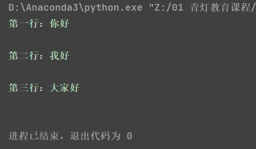

# 文件操作

* 目标
  * 文件操作的作用
  * 文件的基本操作
    - 打开
    - 读写
    - 关闭
  * 文件备份
  * 文件和文件夹的操作


# 1、文件操作的作用

思考：什么是文件？


思考：文件操作包含什么？

答：打开、关闭、读、写、复制....

思考：文件操作的的作用是什么？

答：读取内容、写入内容、备份内容......

> 总结：文件操作的作用就是==把一些内容(数据)存储存放起来，可以让程序下一次执行的时候直接使用，而不必重新制作一份，省时省力==。


# 2、文件的基本操作

## 2.1 文件操作步骤

1. 打开文件
2. 读写等操作
3. 关闭文件 不去及时关闭文件 他仍然会在电脑的后台 存储  数据可能会泄露的

> 注意：可以只打开和关闭文件，不进行任何读写操作。

### 2.1.1  打开

在python，使用open函数，可以打开一个已经存在的文件，或者创建一个新文件，语法如下：

``` python
open(name, mode)
```

name：是要打开的目标文件名的字符串(可以包含文件所在的具体路径)。

mode：设置打开文件的模式(访问模式)：只读、写入、追加等。


#### 2.1.1.1 打开文件模式

| 模式 | 描述                                                         |
| :--: | ------------------------------------------------------------ |
|  r   | 以只读方式打开文件。文件的指针将会放在文件的开头。这是默认模式。 |
|  rb  | 以二进制格式打开一个文件用于只读。文件指针将会放在文件的开头。这是默认模式。 |
|  r+  | 打开一个文件用于读写。文件指针将会放在文件的开头。           |
| rb+  | 以二进制格式打开一个文件用于读写。文件指针将会放在文件的开头。 |
|  w   | 打开一个文件只用于写入。如果该文件已存在则打开文件，并从开头开始编辑，即原有内容会被删除。如果该文件不存在，创建新文件。 |
|  wb  | 以二进制格式打开一个文件只用于写入。如果该文件已存在则打开文件，并从开头开始编辑，即原有内容会被删除。如果该文件不存在，创建新文件。 |
|  w+  | 打开一个文件用于读写。如果该文件已存在则打开文件，并从开头开始编辑，即原有内容会被删除。如果该文件不存在，创建新文件。 |
| wb+  | 以二进制格式打开一个文件用于读写。如果该文件已存在则打开文件，并从开头开始编辑，即原有内容会被删除。如果该文件不存在，创建新文件。 |
|  a   | 打开一个文件用于追加。如果该文件已存在，文件指针将会放在文件的结尾。也就是说，新的内容将会被写入到已有内容之后。如果该文件不存在，创建新文件进行写入。 |
|  ab  | 以二进制格式打开一个文件用于追加。如果该文件已存在，文件指针将会放在文件的结尾。也就是说，新的内容将会被写入到已有内容之后。如果该文件不存在，创建新文件进行写入。 |
|  a+  | 打开一个文件用于读写。如果该文件已存在，文件指针将会放在文件的结尾。文件打开时会是追加模式。如果该文件不存在，创建新文件用于读写。 |
| ab+  | 以二进制格式打开一个文件用于追加。如果该文件已存在，文件指针将会放在文件的结尾。如果该文件不存在，创建新文件用于读写。 |


#### 2.1.1.2 快速体验

``` python
f = open('test.txt', 'w')
```

> 注意：此时的`f`是`open`函数的文件对象。

### 2.1.2 文件对象方法

##### 2.1.2.1 写

- 语法

``` python
对象对象.write('内容')
```

- 体验

``` python
# 1. 打开文件
f = open('test.txt', 'w')

# 2.文件写入
f.write('hello world')

# 3. 关闭文件
f.close()
```

> 注意：
>
> 1. `w	`和`a`模式：如果文件不存在则创建该文件；如果文件存在，`w`模式先清空再写入，`a`模式直接末尾追加。
> 2. `r`模式：如果文件不存在则报错。


##### 2.1.2.2 读

- read()

``` python
文件对象.read(num)
```

> num表示要从文件中读取的数据的长度（单位是字节），如果没有传入num，那么就表示读取文件中所有的数据。


- readlines()

readlines可以按照行的方式把整个文件中的内容进行一次性读取，并且返回的是一个列表，其中每一行的数据为一个元素。

``` python
f = open('test.txt')
content = f.readlines()

# ['hello world\n', 'abcdefg\n', 'aaa\n', 'bbb\n', 'ccc']
print(content)

# 关闭文件
f.close()
```


- readline()

readline()一次读取一行内容。

``` python
f = open('test.txt')

content = f.readline()
print(f'第一行：{content}')

content = f.readline()
print(f'第二行：{content}')

# 关闭文件
f.close()
```



### 2.1.3 关闭

```open
文件对象.close()
```


### with 上下文管理文件

> 上述文件操作, 打开文件操作完后都需要关闭文件, 比较麻烦。
>
> 可以用 with 上下文管理打开的文件

~~~python
with open('test.txt', mode='r', encoding='utf-8') as f:
    text = f.read()
~~~


# 3、文件夹及目录操作--OS

在日常使用计算机时，经常需要列出一个文件夹或者目录的内容，创建和删除文件，以及做其他一些比较无聊但是不得不做的“家务活”。在 Python 程序中可以做到同样的事，甚至能做更多的事。这些功能是否能减少你的工作量呢？我们拭目以待。

Python 在模块 `os`（操作系统，operating system）中提供了许多系统函数，本章的所有程序都需要导入这个模块。

Python 的 os 模块封装了常见的文件和目录操作，本文只列出部分常用的方法，更多的方法可以查看[官方文档](https://docs.python.org/3/library/os.path.html)。 

### os 目录操作 

| 方法      | 说明             |
| --------- | ---------------- |
| os.mkdir  | 创建目录         |
| os.rmdir  | 删除目录         |
| os.rename | 重命名           |
| os.remove | 删除文件         |
| os.getcwd | 获取当前工作路径 |
| os.chdir  | 修改当前工作目录 |

**os.mkdir**

创建文件目录。

```
os.mkdir('路径')
```

**os.rmdir**

删除文件目录。

```
os.rmdir('路径')
```

**os.rename** 

重命名文件。如果文件不存在则报错

```
os.rename('旧文件名', '新文件名')
```

**os.remove** 

删除文件，文件不存在时报错

```
os.remove('路径')
```

**os.getcwd** 

显示当前程序的工作目录

```
In [2]: os.getcwd()
Out[2]: 'C:\\Users\\Administrator'
```

**os.chdir** 

改变程序的工作目录

```
In [2]: os.getcwd()
Out[2]: 'C:\\Users\\Administrator'

In [3]: os.chdir('C:\\')
In [4]: os.getcwd()
Out[4]: 'C:\\'
```

**案例一:** 

显示当前目录中所有的文件


### os.path 路径操作

`os.path` 模块是跨平台的，即使不打算在平台之间移植自己的程序也应该用 `os.path`，好处多多。

##### 操作路径

后文的例子以下面的目录结构为参考，工作目录为 `'C:\\Users\\Administrator'`。

| 方法             | 说明                         |
| ---------------- | ---------------------------- |
| os.path.join     | 连接目录与文件名             |
| os.path.split    | 分割文件名与目录             |
| os.path.abspath  | 获取绝对路径                 |
| os.path.dirname  | 获取路径                     |
| os.path.basename | 获取文件名或文件夹名         |
| os.path.splitext | 分离文件名与扩展名           |
| os.path.isfile   | 判断给出的路径是否是一个文件 |
| os.path.isdir    | 判断给出的路径是否是一个目录 |
| os.path.exists   | 检查文件是否存在             |

```python
In [4]: os.getcwd()
Out[4]: 'C:\\Users\\Administrator'

In [7]: os.path.abspath('hello.py')
Out[7]: 'C:\\Users\\Administrator\\hello.py'
    
In [8]: os.path.abspath('.')
Out[8]: 'C:\\Users\\Administrator'
```

- os.path.split：分离目录与文件名
  - `split()` 函数将路径分成两个独立的部分，并返回一个`tuple`结果。第二个元素是路径的最后一个元素，第一个元素是它之前的所有元素。
  - `join()` 函数能将两个或者多个独立部分,拼接为一个路径.

```python
In [9]: os.path.split(os.path.abspath('.'))
Out[9]: ('C:\\Users', 'Administrator')
    
In [11]: os.path.join('C:\\Users', 'Administrator')
Out[11]: 'C:\\Users\\Administrator'
```

- os.path.splitext：分离文件名与扩展名

  `splitext()`类似于`split()`，但在扩展分隔符上划分路径，而不是目录分隔符。

```python
In [17]: os.path.splitext('filename.txt')
Out[17]: ('filename', '.txt')
```

**案例二:**

在测试文件夹下, 给所有的 `txt` 文件前加上前缀 `[前缀]` 两个字

##### 检查路径

- os.path.dirname：获取文件或文件夹的路径

```python
In [7]: os.path.dirname('C:\\Users\\Administrator\\hello.py')
Out[7]:'C:\\Users\\Administrator'

In [8]: os.path.dirname('C:\\Users\\Administrator\\python')
Out[8]: 'C:\\Users\\Administrator'
    
In [9]: os.path.dirname('C:\\Users\\Administrator')
Out[9]: 'C:\\Users'
```

- os.path.basename：获取文件名或文件夹名

```python
In [10]: os.path.basename('C:\\Users\\Administrator\\hello.py')
Out[10]: 'hello.py'

In [11]: os.path.basename('/Users/ethan/coding/python')
Out[11]: 'python'
```

- os.path.isfile/os.path.isdir

```python
In [17]: os.path.isfile('C:\\Users\\Administrator\\hello.py')
Out[17]: True
    
In [18]: os.path.isfile('C:\\Users\\Administrator\\hello1.py')
Out[18]: False
    
In [20]: os.path.isdir('C:\\Users\\Administrator\\hello1.py')
Out[20]: False

In [21]: os.path.isdir('C:\\Users\\Administrator')
Out[21]: True
```

**案例二:** 

显示当前目录中所有的目录

```
In [12]: [x for x in os.listdir('.') if os.path.isdir(x)]
```


# 拓展:深浅拷贝

#### 对象引用、浅拷贝、深拷贝(拓展、难点、重点)

Python中，对象的赋值，拷贝（深/浅拷贝）之间是有差异的，如果使用的时候不注意，就可能产生意外的结果

其实这个是由于共享内存导致的结果

拷贝：原则上就是把数据分离出来，复制其数据，并以后修改互不影响。

先看 一个非拷贝的例子

##### 使用=赋值（对象引用）

**=赋值：数据完全共享**

=赋值是在内存中指向同一个对象，如果是可变(mutable)类型，比如列表，修改其中一个，另一个必定改变

如果是不可变类型 (immutable) ,比如字符串，修改了其中一个，另一个并不会变

```python
>>> a = [1, 2, 3]
>>> a
[1, 2, 3]
>>> b = a
>>> b
[1, 2, 3]
>>> a[0] = 'surprise'
>>> a
['surprise', 2, 3]

>>> b
['surprise', 2, 3]
>>> b[0] = 'I hate surprises'
>>> b
['I hate surprises', 2, 3]
>>> a
['I hate surprises', 2, 3]

```

##### 浅拷贝（copy）

**浅拷贝：数据半共享（复制其数据独立内存存放，但是只拷贝成功第一层）**

```python
>>> a = [1, 2, 3]
>>> b = a.copy()
>>> c = list(a)
>>> d = a[:]

>>> a[0] = 'integer lists are boring'
>>> a
['integer lists are boring', 2, 3]
>>> b
[1, 2, 3]
>>> c
[1, 2, 3]
>>> d
[1, 2, 3]

```

##### 深拷贝（deepcopy）

**深拷贝：数据完全不共享（复制其数据完完全全放独立的一个内存，完全拷贝，数据不共享）**

深拷贝就是完完全全复制了一份，且数据不会互相影响，因为内存不共享。

深拷贝的方法有

```python
>>> import copy
>>> a = [1, 2, 3, [1, 2, 3]]
>>> b = copy.copy(a)
>>> a[3][0] = "surprises"
>>> b
[1, 2, 3, ['surprises', 2, 3]]

>>> c = copy.deepcopy(b)
>>> b[3][0] = "i hate surprises"
>>> c
[1, 2, 3, ['surprises', 2, 3]]
>>> b
[1, 2, 3, ['i hate surprises', 2, 3]]

```

总结：

copy.copy 浅拷贝 只拷贝父对象，不会拷贝对象的内部的子对象。
copy.deepcopy 深拷贝 拷贝对象及其子对象