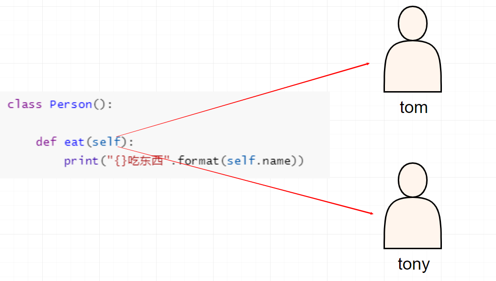
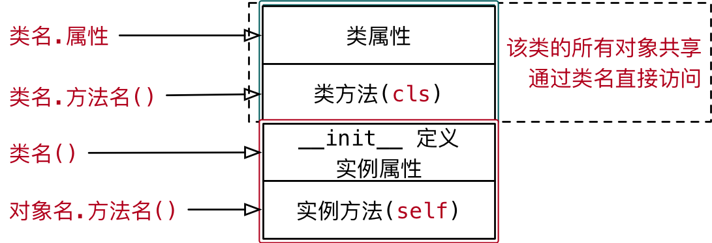

# 类与对象

类里面封装了很多个函数     函数就相当于对象

类型（汉语词语），指包含由各特殊的事物或现象抽出来的共通点的抽象概念；

类（Class）是面向对象程序设计（OOP，Object-Oriented Programming）实现信息封装的基础。

```
类  是指一类按照一定的规则划分出来的一个群体
按照年龄来进行划分
婴儿 少年  青年 壮年  中年 老年
          泽言
          各位同学(就相当于一个一个对象)
          
   按照性别划分 
   男性   女性
   泽言    丸子
          
```

## 面向对象

面向对象编程 —— `Object Oriented Programming` 简写 `OOP` 

对象到底是什么，我们可以从两次层次来理解。

**(1) 对象是单个事物的抽象。**

一本书、一辆汽车、一个人都可以是对象，一个数据库、一张网页、一个与远程服务器的连接也可以是对象。当实物被抽象成对象，实物之间的关系就变成了对象之间的关系，从而就可以模拟现实情况，针对对象进行编程。

例如，一个“人”对象可以表示具有姓名，年龄，身高、体重等属性，具有吃饭，睡觉，呼吸和跑步等行为。

换句话说，面向对象编程是将现实世界的事物在程序中建立模型的关系方法，如汽车以及公司和员工，学生和教师等。OOP将现实世界的实体建模为软件对象，一些与之相关的数据，可以执行某些功能。

**(2) 对象是一个容器，封装了属性（property）和方法（method）。** 

属性是对象的状态，方法是对象的行为（完成某种任务）。比如，我们可以把动物抽象为animal对象，使用“属性”记录具体是那一种动物，使用“方法”表示动物的某种行为（奔跑、捕猎、休息等等）。

在实际开发中，对象是一个抽象的概念，可以将其简单理解为：**数据集或功能集**。

提示：每个对象都是基于一个引用类型创建的，这些类型可以是系统内置的原生类型，也可以是开发人员自定义的类型。

### 什么是面向对象

> 面向对象不是新的东西，它只是过程式代码的一种高度封装，目的在于提高代码的开发效率和可维护性。


面向对象编程（Object-oriented Programming，简称*OOP）*是一种[编程范例](http://en.wikipedia.org/wiki/Programming_paradigm)，它提供了一种结构化程序的方法，以便将属性和行为捆绑到单个对象中。

在面向对象程序开发思想中，每一个对象都是功能中心，具有明确分工，可以完成接受信息、处理数据、发出信息等任务。
因此，面向对象编程具有灵活、代码可复用、高度模块化等特点，容易维护和开发，比起由一系列函数或指令组成的传统的过程式编程（procedural programming），更适合多人合作的大型软件项目。

面向对象与面向过程： 

- 面向过程就是亲力亲为，事无巨细，面面俱到，步步紧跟，有条不紊
- 面向对象就是找一个对象，指挥得结果
- 面向对象将执行者转变成指挥者
- 面向对象不是面向过程的替代，而是面向过程的封装

面向对象的特性：

- 封装性 
- 继承性
- [多态性]抽象

扩展阅读：

- [维基百科 - 面向对象程序设计](https://zh.wikipedia.org/wiki/%E9%9D%A2%E5%90%91%E5%AF%B9%E8%B1%A1%E7%A8%8B%E5%BA%8F%E8%AE%BE%E8%AE%A1) 
- [知乎：如何用一句话说明什么是面向对象思想？](https://www.zhihu.com/question/19854505) 
- [知乎：什么是面向对象编程思想？](https://www.zhihu.com/question/31021366) 

### 面向对象的具体表现

在 Python 中，所有数据类型都可以视为对象，当然也可以自定义对象。
自定义的对象数据类型就是面向对象中的类（ Class ）的概念。

我们以一个例子来说明面向过程和面向对象在程序流程上的不同之处。

假设我们要处理学生的成绩表，为了表示一个学生的成绩，面向过程的程序可以用一个对象表示：

```python
std1 = { 'name': '小明', 'score': 98 }
std2 = { 'name': '小红', 'score': 81 }
```

而处理学生成绩可以通过函数实现，比如打印学生的成绩：

```python
def print_score(student):
    print('姓名：' + student['name'] + '  ' + '成绩：' + str(student['score']))
```

如果采用面向对象的程序设计思想，我们首选思考的不是程序的执行流程，
而是 `Student` 这种数据类型应该被视为一个对象，这个对象拥有 `name` 和 `score` 这两个属性（Property）。
如果要打印一个学生的成绩，首先必须创建出这个学生对应的对象，然后，给对象发一个 `print_socre` 消息，让对象自己把自己的数据打印出来。

抽象数据行为模板（Class）：

```python
class Student(object):
    def __init__(self, name, score):
        self.name = name
        self.score = score

    def print_score(self):
        print('姓名：' + self.name + '  ' + '成绩：' + str(self.score))


```

根据模板创建具体实例对象（Instance）：

```python
std1 = Student('小明', 98)
std2 = Student('小红', 81)
```

实例对象具有自己的具体行为（给对象发消息）：

```python
std1.print_socre() #  => 姓名：Michael  成绩：98
std2.print_socre() #  => 姓名：Bob  成绩 81
```

面向对象的设计思想是从自然界中来的，因为在自然界中，类（Class）和实例（Instance）的概念是很自然的。
Class 是一种抽象概念，比如我们定义的 Class——Student ，是指学生这个概念，
而实例（Instance）则是一个个具体的 Student ，比如， Michael 和 Bob 是两个具体的 Student 。

所以，面向对象的设计思想是：

- 抽象出 Class(构造函数)
- 根据 Class(构造函数) 创建 Instance
- 指挥 Instance 得结果

面向对象的抽象程度又比函数要高，因为一个 Class 既包含数据，又包含操作数据的方法。

## Python的类

Python中可用的原始数据结构（如数字，字符串和列表）旨在分别表示简单的事物，例如进行简单的数学运算，动物的名称和你喜欢的颜色。

如果你想代表更复杂的东西怎么办？

例如对于动物，我们可以创建一个`Animal()` 类来跟踪动物的属性，如名称和年龄。

重要的是要注意一个类只提供结构 ——它是应该如何定义某个东西的模板，但它实际上并不提供任何真实的内容。该 `Animal()` 可以指定姓名和年龄是必要的界定动物，但它实际上并不会说出什么特定动物的姓名或年龄。

### 类和对象的概念

`类` 和 `对象` 是面向对象编程的两个核心概念

`类` 是对一群具有相同 `特征` 或者 `行为` 的事物的一个统称，是抽象的。

- `特征` 被称为 `属性` 
- `行为` 被称为 `方法` 

### 类和对象的关系

- `类` 是模板，`对象` 是根据 `类` 这个模板创建出来的，应该先有类，再有对象
- `类` 只有一个，而 `对象` 可以有很多个
  - `不同的对象` 之间 `属性` 可能会各不相同
  - `类` 中定义了什么 `属性和方法`，`对象` 中就有什么属性和方法


# 创建对象

## Init方法

### 隐式的基类——object

每个Python类的定义都会隐式继承自 `object` 类，它的定义非常简单，几乎什么行为都不包括。我们可以创建一个`object` 实例，但很多事情无法完成，因为很多特殊方法的调用程序都会抛出异常。

对于任何自定义类，都会隐式继承`object` 。以下是一个类定义的示例（隐式继承了`object` 类）。

```python
class Person:
    pass
```

下面是对自定义类进行交互的代码。

```python
>>> X.__class__
<class 'type'>
>>> X.__class__.__base__
<class 'object'>
```

可以看到类定义就是对`type` 类的一个对象的类型声明，基类为`object` 。

相应地，派生自`object` 类中的对象方法也将继承各自相应的默认实现。在某些情况下，基类中一些特殊方法的默认行为也正是我们想要的。对于一些特殊情况，就需要重写这些方法。

> 注意：`类名` 的 命名规则 要符合 `大驼峰命名法` 

### 初始化方法

`__init__()` 方法的重要性体现在两点。首先，初始化既是对象生命周期的开始，也是非常重要的一个步骤，每个对象都必须正确地执行了初始化才能够正常地工作。其次，`__init()__` 方法的参数可以多种形式来完成赋值。

通过实现`__init()__` 方法来初始化一个对象。每当创建一个对象，Python会先创建一个空对象，然后调用该对象的`__init()__` 函数。这个方法提供了对象内部变量以及其他一些一次性过程的初始化操作。

```python
class Person:

    def __init__(self):

        print("这是一个初始化方法")
        

# 使用类名()创建对象的时候，会自动调
tom = Person()
```


### 初始化属性

一个对象是一系列功能的集合，包括了方法和属性。`object` 类的默认行为包括设置、获取和删除属性。可以通过修改这些默认行为来决定对象中哪些属性是可用的。

默认情况下，创建任何类内部的属性都将支持以下4种操作。

- 创建新属性。
- 为已有属性赋值。
- 获取属性的值。
- 删除属性。

我们可以使用如下简单的代码来对这些操作进行测试，创建一个简单的泛型类并将其实例化。

- 在 `__init__` 方法内部使用 `self.属性名 = 属性的初始值` 就可以 定义属性
- 定义属性之后，再使用 `Cat` 类创建的对象，都会拥有该属性


例如在玩游戏时，我们创建人物对象一般会需要人物的明显与年龄等特这个，我们可以用代码来模拟整个创建过程

```python
"""
定义一个人（Person）类
    人在出生时就会有名字、身高、体重等属性

    人在刚出生是会哭、喝、吃等行为
"""


class Person(object):

    def __init__(self, name, age):
        """初始化方法"""
        self.name = name
        self.age = age

    def hello(self):
        print('我的名字是：{}，已经：{}岁了'.format(self.name, self.age))


tom = Person('汤姆', 18)
# 获取属性
print(tom.name)
print(tom.age)

# 在外部修改属性
tom.age = 18

# 再外部新增属性
tom.gender = '男'

tom.hello()
```

### 基类中的init方法

对象的生命周期主要包括了创建、初始化和销毁。后面章节会详细讨论对象的创建和销毁，本章专注于对象的初始化。

object作为所有类的基类，已经为`__init__()` 方法提供了默认实现，一般情况下不需要重写这个函数。如果没有对它进行重写，那么在创建对象时将不会产生其他变量的实例。在某些情况下，这种默认行为是可以接受的。

对于继承自`object` 的子类，总可以对它的属性进行扩展。例如，对于下面这个类，实例化就不对函数（`area` ）所需要的变量（`width` 和`length` ）进行初始化。

```python
class Person(object):

    # def __init__(self):
    #     pass

    def hello(self):
        print('我的名字是：{}，已经：{}岁了'.format(self.name, self.age))

```

`Person` 类的`hello` 函数在返回值时使用了两个属性，可并没有在任何地方对其赋值。在Python中，这种看似奇怪的调用尚未赋值属性的操作却是合法的。

下面这段代码演示如何使用刚定义的`Person` 类。

```python
>>> tom = Person()
>>> tom.name = '汤姆'
>>> tom.age = '18'
>>> tom.hello()
我的名字是：汤姆，已经：18岁了
```

虽然这种延迟赋值的实现方式在Python中是合法的，但是却给调用者带来了潜在的困惑，因此要尽量避免这样的用法。

然而，这样的设计看似又提供了灵活性，意味着在`__init__()` 方法被调用时不必为所有的属性赋值。这看似是不错的选择，一个可选属性即可以看作是某子类中的成员，且无须对这个子类进行显式地定义就可以完成对原生机制的扩展。然而这种多态机制不但给程序带来了隐藏的不确定性，也会相应产生很多令人费解的`if` 语句。

因此，延迟初始化属性的设计在某种情形下可能会有用，可是这样也可能会导致非常糟糕的设计。

在*Zen of python poem* 一书中曾提出过这样的建议：

“显式而非隐式”。

对于每个`__init__()` 方法，都应当显式地指定要初始化的变量。

糟糕的多态 在灵活性与糟糕之间有一个临界。 一旦发觉书写了这样的代码，我们就已经丧失了灵活性并开始了糟糕的设计。 `　　if 'x' in self.__dict__:` 或： `　 try:` `　 　　self.x` `　except AttributeError:` 这时就要考虑添加一个公共函数或属性来重构这个API，相比于添加if语句，重构将是更好的选择。


## Python对象（实例）

### 初始化属性

如果希望在创建对象的同时，就设置对象的属性，可以对 `__init__` 方法进行改造

1. 修改 `__init__` 方法的接收参数
2. 在方法内部使用 `self.属性 = 形参` 接收外部传递的参数
3. 在创建对象时，使用 `类名(属性1, 属性2...)` 调用

```python
	def __init__(self, name, high, weight):
        """初始化方法"""
        self.name = name
        self.high = high
        self.weight = weight
```

当一个类定义完成之后，要使用这个类来创建对象，语法格式如下：

```python
对象变量 = 类名()
```

### 方法中的 self

由哪一个对象调用的方法，方法内的 `self` 就是哪一个对象的引用

- 在类封装的方法内部，`self` 就表示当前调用方法的对象自己
- 调用方法时，程序员不需要传递 `self` 参数
- 在方法内部
  - 可以通过 `self.` 访问对象的属性
  - 也可以通过 `self.` 调用其他的对象方法
- 改造代码如下：

```python
class Person:
	def __init__(name):
        self.name = name
        
    def eat(self):
        print("{} 吃东西".format(self.name))

Tony = Person("Tony")
Tony.eat()

tom = Person("Tom") 
tom.eat()
```



- 在类的外部，通过 `变量名.` 访问对象的属性和方法
- 在类封装的方法中，通过 `self.` 访问对象的属性和方法

**面向对象三大特性**

封装继承与多态

1. 封装 根据职责将**属性**和**方法**封装到一个抽象的类中
2. 继承 实现代码的重用，相同的代码不需要重复的编写
3. 多态 不同的对象调用相同的方法，产生不同的执行结果，增加代码的灵活度

# 类对象(了解)

1. 使用面相对象开发，**第 1 步** 是设计 **类** 
2. 使用 **类名()** 创建对象，**创建对象** 的动作有两步：
   - 1) 在内存中为对象 **分配空间** 
   - 2) 调用初始化方法 `__init__` 为 **对象初始化** 
3. 对象创建后，**内存** 中就有了一个对象的 **实实在在** 的存在 —— **实例** 

因此，通常也会把：

1. 创建出来的 **对象** 叫做 **类** 的 **实例** 
2. 创建对象的 **动作** 叫做 **实例化** 
3. **对象的属性** 叫做 **实例属性**  
4. **对象调用的方法** 叫做 **实例方法** 

在程序执行时：

1. 对象各自拥有自己的 **实例属性** 
2. 调用对象方法，可以通过 `self.` 
   - 访问自己的属性
   - 调用自己的方法

每一个对象都有自己独立的内存空间，保存各自不同的属性

多个对象的方法，在内存中只有一份，在调用方法时，需要把对象的引用传递到方法内部

## 类是一个特殊的对象

> `Python` 中 **一切皆对象**：
>
> - `class AAA:` 定义的类属于 **类对象** 
> - `obj1 = AAA()` 属于 **实例对象** 

在程序运行时，**类** 同样 **会被加载到内存** 

在 `Python` 中，**类** 是一个特殊的对象 —— **类对象** 

在程序运行时，**类对象** 在内存中 **只有一份**，使用 **一个类** 可以创建出 **很多个对象实例** 

- 除了封装 **实例** 的 **属性** 和 **方法**外，**类对象** 还可以拥有自己的 **属性** 和 **方法** 
  1. **类属性** 
  2. **类方法** 
- 通过 **类名.** 的方式可以 **访问类的属性** 或者 **调用类的方法** 



## 类属性

- **类属性** 就是给 **类对象** 中定义的 **属性** 
- 通常用来记录 **与这个类相关** 的特征 
- **类属性** **不会用于**记录 **具体对象的特征** 

**示例需求** 

1. 定义一个 Dinosaur
2. 用 **Dinosaur** 实例化了多个游戏对象
3. **需求** —— 知道使用这个类，创建了多少个对象？

```python
class Dinosaur:
    """这是一个人类"""
    name = '恐龙'  # 类属性

    @staticmethod
    def hello(mcs):
        print('我是{}类'.format(mcs.name))


print(Dinosaur.name)
```


## 类的方法

### 静态方法

在开发时，如果需要在 **类** 中封装一个方法，这个方法：
- 既 **不需要** 访问 **实例属性** 或者调用 **实例方法** 没有self  没有cls  括号里面是什么都没有的
- 也 **不需要** 访问 **类属性** 或者调用 **类方法** 

这个时候，可以把这个方法封装成一个 **静态方法** 

语法如下

```python
class Example:

    @staticmethod
    def func():
        pass
```

- **静态方法** 需要用 **修饰器** `@staticmethod` 来标识，**告诉解释器这是一个静态方法** 
- 通过 **类名.** 调用 **静态方法** 


案例：显示游戏帮助信息

```python
class GamePerson(object):
    
    @staticmethod
    def show_help():
        print("""欢迎进入xxx小游戏,我是游戏小助手。游戏时请注意。。。。""")
```


### 类方法

**类属性** 就是针对 **类对象** 定义的属性

- 使用 **赋值语句** 在 `class` 关键字下方可以定义 **类属性** 
- **类属性** 用于记录 **与这个类相关** 的特征 

**类方法** 就是针对 **类对象** 定义的方法 

- 在 **类方法** 内部可以直接访问 **类属性** 或者调用其他的 **类方法** 

**语法如下**

```python
@classmethod
def 类方法名(cls):
    pass

```

- 类方法需要用 **修饰器** `@classmethod` 来标识，**告诉解释器这是一个类方法** 
- 类方法的 **第一个参数** 应该是 `cls` 
  - 由 **哪一个类** 调用的方法，方法内的 `cls` 就是 **哪一个类的引用** 
  - 这个参数和 **实例方法** 的第一个参数是 `self` 类似
  - **提示** 使用其他名称也可以，不过习惯使用 `cls` 
- 通过 **类名.** 调用 **类方法**，**调用方法时**，不需要传递 `cls` 参数
- 在方法内部
  - 可以通过 `cls.` **访问类的属性**
  - 也可以通过 `cls.` **调用其他的类方法**


**示例需求**

- 在类属性中定义一个 `player_name` 用于统计正在玩游戏的人
- 一但有人进入游戏，就将其记录到 `player_name` 中
- 定义一个方法 `show_players` 输出正在玩游戏的人

```python
    @classmethod
    def show_players(cls):
        """查看正在玩游戏的人"""
        print(cls.player_name)

```

> 在类方法内部，可以直接使用 `mcs` 访问 **类属性** 或者 **调用类方法**

## 私有属性方法（了解）

关于Python中的私有化可以概括为：大家都是成年人。

面向对象设计使得接口和实现有了很大的差别，这也是封装的意义。一个类封装了一种数据结构、一个算法和一个外部接口等，程序设计的目的是要把接口与实现分离。

然而，没有编程语言会暴露出所有设计的细节。对于Python，也是如此。

关于类设计的一个方面，这一点没有用代码演示：对象中有关私有（实现）和公有（接口）函数或属性的差异。有些编程语言只是在概念上支持私有（C++或Java是两个例子）已经很复杂了。这类语言中的访问修饰符包括了私有、保护、公有和“未指定”，可以理解为半私有。私有关键字经常被错误使用，为子类的定义带来了没必要的复杂性。

Python中私有的概念很简单，如下所示。

- 基本都是公有。源代码随时可修改，大家都是成年人，没有什么是可以真正被隐藏的。
- 传统上，我们会使用命名来表明哪些不是完全公有的。它们通常是容易变化的具体实现细节，然而并不存在正式的、概念上的私有。

Python中的部分函数以_命名，标记为不完全公有。

Python的内部命名以`__` 起始（和结尾）。这也是Python如何避免内部和外部应用程序发生冲突的方式。这些内部集合的命名方式完全只是参考。毕竟，没有必要在代码中试图使用 `__` 前缀来定义一个“超级私有”的属性或函数。如果这样做的话就为以后制造了一个潜在的麻烦，当新版本的Python发布并使用了同样命名的函数或属性时，就会有命名冲突。我们还有可能和新版本中的其他名称发生冲突。

Python中关于可见度的命名规则如下所示。

- 大部分名称是公有的。
- 以_开始的名字通常不完全公有。使用它们来命名那些经常变化的函数，这些函数通常是实现细节。
- 以__作为前缀和后缀的函数通常是Python内部的。程序中不该使用；命名要参考编程语言的定义。

通常，Python中的命名是根据函数（或属性）的目的来定义的，并提供文档说明。通常接口函数会有说明文档以及文档测试的例子，而实现细节的函数就不必了，提供简单的说明就可以了。

**应用场景**

- 在实际开发中，**实例对象** 的 **某些属性或方法** 可能只希望 **在实例对象的内部被使用**，而 **不希望在外部被访问到** 。
- **私有属性** 就是 **实例对象** 不希望公开的 **属性** 
- **私有方法** 就是 **实例对象** 不希望公开的 **方法** 


**定义方式** 

- 在 **定义属性或方法时**，在 **属性名或者方法名前** 增加 **两个下划线**，定义的就是 **私有** 属性或方法

```python
class Women(object):

    def __init__(self, name, high, age):
        self.name = name
        self.high = high
        # 双下划线 私有属性 外部无法调用
        self.__age = age

    def __fly(self):
        return self.__age

    def __secret(self):
        print("我的年龄是 %d" % self.__age)


fang = Women("小芳")
# 私有属性，外部不能直接访问
# print(fang.__age)

# 私有方法，外部不能直接调用
# xiaofang.__secret()

```


### 案例小结

1. **实例方法** —— 方法内部需要访问 **实例属性**  
   - **实例方法** 内部可以使用 **类名.** 访问类属性
2. **类方法** —— 方法内部 **只** 需要访问 **类属性** 
3. **静态方法** —— 方法内部，不需要访问 **实例属性** 和 **类属性** 

**提问** 

如果方法内部 即需要访问 **实例属性**，又需要访问 **类属性**，应该定义成什么方法？

**答案**

- 应该定义 **实例方法** 
- 因为，**类只有一个**，在 **实例方法** 内部可以使用 **类名.** 访问类属性


### 了解: 特性@property

> 还有一个更加形象的名字：计算属性

特性是一个函数，看起来（在语法上）就是一个简单的属性。我们可以获取、设置和删除特性值，正如我们可以获取、设置和删除属性值。这里有一个重要的区别：特性是一个函数，而且可以被调用，而不仅仅是用于存储的对象的引用。

除了复杂程度，特性和属性的另一个区别在于，我们不能轻易地为已有对象添加新特性。但是默认情况下，我们可以很容易地给对象添加新属性。在这一点上，特性和属性有很大区别。

我们可以使用`@property` 修饰符来创建特性。

```python
class Triangle:
    def __init__(self, width, height):
        self.w = width
        self.h = height

    @property
    def area(self):
        return self.w * self.h / 2


t = Triangle(3, 4)
# print(t.area())
print(t.area)
```


