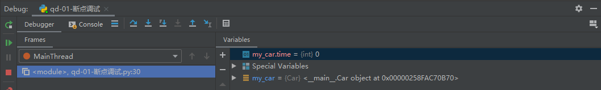

# 一、模块和包

* 目标
  * 了解模块
  * 导入模块
  * 制作模块
  * 包的使用方法

## 1、模块

Python 模块(Module)，是一个 Python 文件，以 .py 结尾，包含了 Python 对象定义和Python语句。

模块能定义函数，类和变量，模块里也能包含可执行的代码。

### 1、1 导入模块

#### 1、1、1 导入模块的方式

- import 模块名
- from 模块名 import 功能名
- from 模块名 import *
- import 模块名 as 别名
- from 模块名 import 功能名 as 别名

#### 1、1、2 导入方式详解

##### 1、1、2、1 import

- 语法

``` python
# 1. 导入模块
import 模块名
import 模块名1, 模块名2...

# 2. 调用功能
模块名.功能名()
```

- 体验

``` python
import math
print(math.sqrt(9))  # 3.0
```

##### 1、1、2、2 from..import..

- 语法

``` python
from 模块名 import 功能1, 功能2, 功能3...
```

- 体验

``` python
from math import sqrt
print(sqrt(9))
```

##### 1、1、2、3 from .. import *

- 语法

``` python
from 模块名 import *
```

- 体验

``` python
from math import *
print(sqrt(9))
```

##### 1、1、2、4 as定义别名

- 语法

``` python
# 模块定义别名
import 模块名 as 别名

# 功能定义别名
from 模块名 import 功能 as 别名
```

- 体验

``` python
# 模块别名
import time as tt

tt.sleep(2)
print('hello')

# 功能别名
from time import sleep as sl
sl(2)
print('hello')
```

### 1、2 制作模块

在Python中，每个Python文件都可以作为一个模块，模块的名字就是文件的名字。**也就是说自定义模块名必须要符合标识符命名规则。**

#### 1、2、1 定义模块

新建一个Python文件，命名为`my_module1.py`，并定义`testA`函数。

``` python
def testA(a, b):
    print(a + b)
```

#### 1、2、2 测试模块

在实际开中，当一个开发人员编写完一个模块后，为了让模块能够在项目中达到想要的效果，这个开发人员会自行在py文件中添加一些测试信息.，例如，在`my_module1.py`文件中添加测试代码。

``` python
def testA(a, b):
    print(a + b)


testA(1, 1)
```

此时，无论是当前文件，还是其他已经导入了该模块的文件，在运行的时候都会自动执行`testA`函数的调用。

解决办法如下：

``` python
def testA(a, b):
    print(a + b)

# 只在当前文件中调用该函数，其他导入的文件内不符合该条件，则不执行testA函数调用
if __name__ == '__main__':
    testA(1, 1)
```

#### 1、2、3 调用模块

```python
import my_module1
my_module1.testA(1, 1)
```

### 1、3 模块定位顺序

当导入一个模块，Python解析器对模块位置的搜索顺序是：

1. 当前目录
2. 如果不在当前目录，Python则搜索在shell变量PYTHONPATH下的每个目录。
3. 如果都找不到，Python会察看默认路径。UNIX下，默认路径一般为/usr/local/lib/python/

模块搜索路径存储在system模块的sys.path变量中。变量里包含当前目录，PYTHONPATH和由安装过程决定的默认目录。

> 注意: 自己的文件名不要和已有模块名重复，否则导致模块功能无法使用

## 2、包

包将有联系的模块组织在一起，即放到同一个文件夹下，并且在这个文件夹创建一个名字为`__init__.py` 文件，那么这个文件夹就称之为包。

### 2、1 制作包

[New] — [Python Package] — 输入包名 — [OK] — 新建功能模块(有联系的模块)。

[新建] — [python 软件包] — 输入包名 — [OK] — 新建功能模块(有联系的模块)。

注意：新建包后，包内部会自动创建`__init__.py`文件，这个文件控制着包的导入行为。

#### 2、1、1 快速体验

1. 新建包`mypackage`
2. 新建包内模块：`my_module1` 和 `my_module2`
3. 模块内代码如下

``` python
# my_module1
print(1)


def info_print1():
    print('my_module1')
```

``` python
# my_module2
print(2)


def info_print2():
    print('my_module2')
```

### 2、2 导入包

``` python
import 包名.模块名
from 包名.模块名 import 函数名
```

##### 2、2、1、1 体验

``` python
"""方法1"""
import mypackage.my_module1
mypackage.my_module1.info_print1()

"""方法2"""
from mypackage.my_module2 import info_print2
info_print2()
```


* 将学生信息管理系统封装成一个包文件🤭


## 总结

- 导入模块方法

``` python
import 模块名

from 模块名 import 目标

from 模块名 import *
```

- 导入包

``` python
import 包名.模块名

from 包名 import *
```

# 二、异常

* 目标
  * 了解异常
  * 捕获异常
  * 异常的else
  * 异常finally
  * 异常的传递
  * 自定义异常

## 1、了解异常

当检测到一个错误时，解释器就无法继续执行了， 反而出现了一些错误的提示，这就是所谓的"异常"。

例如：以`r`方式打开一个不存在的文件。

``` python
open('test.txt', 'r')
```


## 2、异常的写法

### 2.1 语法

``` python
try:
    可能发生错误的代码
except:
    如果出现异常执行的代码
```

### 2.2 快速体验

需求：尝试以`r`模式打开文件，如果文件不存在，则以`w`方式打开。

``` python
try:
    f = open('test.txt', 'r')
except:
    f = open('test.txt', 'w')
```

### 2.3 捕获指定异常

#### 2.3.1 语法

``` python
try:
    可能发生错误的代码
except 异常类型:
    如果捕获到该异常类型执行的代码
```

#### 2.3.2 体验

``` python
try:
    print(num)
except NameError:
    print('有错误')
```

> 注意：
>
> 1. 如果尝试执行的代码的异常类型和要捕获的异常类型不一致，则无法捕获异常。
> 2. 一般try下方只放一行尝试执行的代码。

#### 2.3.3 捕获多个指定异常

当捕获多个异常时，可以把要捕获的异常类型的名字，放到except 后，并使用元组的方式进行书写。

``` python
try:
    print(1/0)

except (NameError, ZeroDivisionError):
    print('有错误')
```

#### 2.3.4 捕获异常描述信息

``` python
try:
    print(num)
except (NameError, ZeroDivisionError) as result:
    print(result)
```

#### 2.3.5 捕获所有异常

Exception是所有程序异常类的父类。

``` python
try:
    print(num)
except Exception as result:
    print(result)
```

### 2.4 异常的else

else表示的是如果没有异常要执行的代码。

``` python
try:
    print(1)
except Exception as result:
    print(result)
else:
    print('我是else，是没有异常的时候执行的代码')
```

### 2.5 异常的finally

finally表示的是无论是否异常都要执行的代码，例如关闭文件。

``` python
try:
    f = open('test.txt', 'r')
except Exception as result:
    f = open('test.txt', 'w')
else:
    print('没有异常，真开心')
finally:
    f.close()
```

## 3、异常的传递

体验异常传递

需求：

​	1. 尝试只读方式打开test.txt文件，如果文件存在则读取文件内容，文件不存在则提示用户即可。

​	2. 读取内容要求：尝试循环读取内容，读取过程中如果检测到用户意外终止程序，则`except`捕获异常并提示用户。

``` python
import time
try:
    f = open('test.txt')
    try:
        while True:
            content = f.readline()
            if len(content) == 0:
                break
            time.sleep(2)
            print(content)
    except:
        # 如果在读取文件的过程中，产生了异常，那么就会捕获到
        # 比如 按下了 ctrl+c
        print('意外终止了读取数据')
    finally:
        f.close()
        print('关闭文件')
except:
    print("没有这个文件")
```

## 4、抛出异常

### 4、1 raise主动抛出异常

在Python中，抛出自定义异常的语法为` raise 异常类对象`。

需求：密码长度不足，则报异常（用户输入密码，如果输入的长度不足3位，则报错，即抛出自定义异常，并捕获该异常）。

``` python
def main():
    # 2. 抛出异常: 尝试执行：用户输入密码，如果长度小于3，抛出异常
    try:
        password = input('请输入密码：')
        if len(password) < 3:
            # 抛出异常类创建的对象
            raise Exception(f'您输入的密码长度是{len(password)}, 密码不能少于 3')
    # 3. 捕获该异常
    except Exception as result:
        print(result)
    else:
        print('没有异常，密码输入完成')

if __name__ == '__main__':
    main()
```

### 4、2 assert 断言

使用assert断言是学习python 一个非常好的习惯，python assert 断言 句语格式及用法很简单。在没完善一个程序之前，我们不知道程序在哪里会出错，与其让它在运行最崩溃，不如在出现错误条件时就崩溃，这时候就需要 assert 断言的帮助。本文主要是讲 assert 断言的基础知识。

> 什么是断言

断言是作为一种调试工具被发明出来的，用来检查那些“代码写对了就肯定成立”的条件。例如下面这种：

```python
>>> assert 1 < 2
>>> assert 1 > 2
Traceback (most recent call last):
  File "<stdin>", line 1, in <module>
AssertionError
```

当条件不满足时，就会抛出 AssertionError 异常

> 断言的作用

python assert 断言是声明其布尔值必须为真的判定，如果发生异常就说明表达示为假。可以理解assert断言语句为raise-if-not，用来测试表示式，其返回值为假，就会触发异常。

> 断言语句的语法格式

assert的异常参数，其实就是在断言表达式后添加字符串信息，用来解释断言并更好的知道是哪里出了问题。格式如下：

+ `assert expression [, arguments]`
+ `assert 表达式 [, 参数]`

> 断言 or 异常

我们思考这几个问题：断言应该用在哪些情境下？异常和断言的区别是什么？

用一句话来概括断言的使用场景和与异常的区别：

> 检查先验条件使用断言，检查后验条件使用异常

我们定义一个 read_file 函数：

```
def read_file(file_path):
    pass
```

read_file 函数要求在开始执行的时候满足一定条件：file_path 必须是 str 类型，这个条件就是先验条件，如果不满足，就不能调用这个函数，如果真的出现了不满足条件的情况，证明代码中出现了bug，这时候我们就可以使用assert语句来对 file_path 的类型进行推断，提醒程序员修改代码，这样的推断在生产环境中是不需要的，也可以使用 if + raise 语句来实现 assert，但是要繁琐很多。

文件不存在和没有权限，这两种情况并不属于代码 bug，是代码逻辑的一部分，上层代码捕获异常后可能会执行其他逻辑，因此我们不能接受这部分代码在生产环境中被忽略。并且，相比于 assert 语句只能抛出 AssertionError ，使用异常可以抛出更细致的错误，方便上层代码针对不同错误执行不同的逻辑。


## 5、总结

- 异常语法

``` python
try:
  	可能发生异常的代码
except:
  	如果出现异常执行的代码
else:
  	没有异常执行的代码
finally:
  	无论是否异常都要执行的代码
```

- 捕获异常

``` python
except 异常类型:
  	代码

except 异常类型 as xx:
		代码
```

- 抛出异常

``` python
# 抛出异常
raise 异常类名()

# 捕获异常
assert 条件, 异常描述
```

# 拓展-断点调试

## 1、调试

Debug调试，是一项学习编程人员的重要技能。只有当你学会 debug 了以后，才可以正确的知道程序的走向流程

### 1、1 debug 介绍

在正式讲解之前，先来了解下 debug 这个词的由来，就像我们初学Python 时，先要了解下它历史的由来。

> 1937年，美国青年霍华德·艾肯找到IBM公司为其投资200万美元研制计算机，第一台成品艾肯把它取名为：马克1号（mark1），又叫“自动序列受控计算机”，从这时起IBM公司由生产制表机，肉铺磅秤，咖啡研磨机等乱七八糟玩意儿行业，正式跨进“计算机”领地。
>
> 为马克1号编制程序的是哈佛的一位女数学家葛丽斯·莫雷·霍波，有一天，她在调试程序时出现故障，拆开继电器后，发现有只飞蛾被夹扁在触点中间，从而“卡”住了机器的运行。于是，霍波诙谐的把程序故障统称为“臭虫（BUG）”，把排除程序故障叫DEBUG，而这奇怪的“称呼”，后来成为计算机领域的专业行话。从而debug意为排除程序故障的意思。
> ——百度百科

看了上面的小故事，debug 一词的由来，是由 bug 词得来的，bug 是臭虫的意思，debug 就是解决臭虫。

在如今的互联网时代，多少你肯定听说过 bug 这个词，比如什么什么软件又出 bug 了！说的就是软件在使用的过程中，程序出现了一些错误。故称之为 bug。

**而 debug 则是通过工具来对代码进行调试，一步步找出程序中出现 bug 的位置，也就是程序中具体错误代码的位置。**就像故事中所说，debug过程就是在解决虫子一样。。

### 1、2 启动 debug 模式

还是用示例说话，我们书写一段简短的代码，来帮我们完成今天要讲的内容。

pycharm 导航栏处，有个run，点开以后即可看到 debug 。

创建并运行了 Car 脚本

```python
class Car:

    def __init__(self, speed=0):
        self.speed = speed
        self.odometer = 0
        self.time = 0

    def say_state(self):
        print("里程 {}, 目前时速{}".format(self.odometer, self.speed))

    def accelerate(self):
        self.speed += 5

    def brake(self):
        self.speed -= 5

    def step(self):
        self.odometer += self.speed
        self.time += 1
        print('小车往前开动了一段距离')

    def average_speed(self):
        return self.odometer / self.time

    def main(self):
        while True:
            action = input("我该做什么? [A]加速, [B]刹车, "
                           "[O]显示里程表, [S]显示平均速度?").upper()
            if action not in "ABOS" or len(action) != 1:
                print("我不知道该怎么做")
                continue
            if action == 'A':
                self.accelerate()
            elif action == 'B':
                self.brake()
            elif action == 'O':
                print("车开了 {} 公里".format(self.odometer))
            elif action == 'S':
                print("汽车的平均速度为 {} 公里/小时".format(self.average_speed()))
            self.step()
            self.say_state()


if __name__ == '__main__':
    my_car = Car()
    print("我是一辆车!")
    my_car.main()

```

让我们看看当我们启动脚本时会发生什么，并且试着找出我们的平均速度:


Pycharm 报告一个运行时错误: ZeroDivisionError。

让我们更深入地研究一下我们的代码，找出出了什么问题。 我们可以使用 PyCharm 调试器来查看代码中到底发生了什么。 要开始调试，必须首先设置一些断点。 要创建断点，只需单击 gutter 即可


接下来，单击主子句旁边    中的图标，然后选择 Debug‘。 Pycharm 启动调试会话并显示“调试工具”窗口。


点击按钮继续脚本执行，在 Console 选项卡中输入 s:


单击  按钮恢复脚本执行。 现在你瞧！ 这里是个例外。 另一个断点也出现了: 默认情况下，PyCharm 会暂停代码中未捕获的任何异常，并显示一个带有闪电的断点图标。


调试器还显示错误消息。 所以我们找到了问题所在。 在调试器中还可以看到 self.time 的值为零

**修改错误**

为了避免再次遇到同样的问题，我们添加一个 if 语句来检查时间是否等于零。 为此，在方法的平均速度中选择语句 return self.odometer / self.time，然后按 Ctrl + Alt + t (Code | round with) :


PyCharm创建弹出一个提示框，我们可以选择给选中的代码添加上去。

## 2、详细调试

Debug 工具窗口显示框架（frames）、变量（variables）和监视器（watches）的专用窗格，以及显示所有输入和输出信息的控制台（console）。 如果希望控制台始终可见，可以将其拖动到 PyCharm 窗口的边缘。

### 2、1 单步调试

如果你希望逐行查看代码的内容，则不需要在每一行上设置断点，您可以逐步查看代码。


让我们来看看单步执行示例程序是什么样的: 单击 Resume 图标按钮，进入控制台以询问汽车的平均速度(类型为“ s”) ，我们可以看到我们按下了断点。


我们可以使用单步工具栏按钮来选择下一个要停止的行。


例如，单击“ **跳过”** 按钮，然后看到蓝色标记移至下一行代码：

如果单击“单**步执行”**按钮，您将在该行之后看到

```
action = input("我该做什么? [A]加速, [B]刹车, "
                       "[O]显示里程表, [S]显示平均速度?").upper()
```

调试器进入文件 `parse.py` ：


但是，如果继续使用，则会看到您的应用程序仅传递到下一个循环：


如果您想专注于自己的代码，请使用“ **进入我的代码”**按钮 -这样您就可以避免进入库类。

有关 详细信息，请参见[步进工具栏](https://www.jetbrains.com/help/pycharm/debug-tool-window.html#steptoolbar)和单 [步执行程序](https://www.jetbrains.com/help/pycharm/stepping-through-the-program.html)部分。

### 2、2 监视器

PyCharm允许您观看任何变量。只需单击该工具栏上的**手表**选项卡，然后输入你想要观看的变量的名称-`my_car.time`。请注意，此处提供代码完成功能：


首先，您会看到时间等于 0 这意味着该变量尚未定义：



但是，当程序执行继续到定义变量的范围时，监视将获得以下视图：


有关详细信息，请参见[添加，编辑和删除监视器](https://www.jetbrains.com/help/pycharm/adding-editing-and-removing-watches.html)部分。

### 2、3 内联调试

您可能已经注意到了另一个PyCharm功能，它可以很容易地查看您的代码在做什么： [内联调试器](https://www.jetbrains.com/help/pycharm/inline-debugging.html)。按下任何断点后，PyCharm就会在编辑器中立即向您显示许多变量的值：


### 2、4 计算表达式

最后，您可以随时评估任何表达式。例如，如果要查看变量的值，请单击按钮。

然后在打开的对话框中，点击**Evaluate**：

例如，如果输入里程表的期望值（例如50），然后继续单步执行脚本，则会得到以下信息：


有关详细信息，请参见“ [评估表达式”](https://www.jetbrains.com/help/pycharm/evaluating-expressions.html)部分。

### 2、5 快捷键

step over（F8快捷键）：在单步执行时，在函数内遇到子函数时不会进入子函数内单步执行，而是将子函数整个执行完再停止，也就是把子函数整个作为一步。在不存在子函数的情况下是和step into效果一样的。简单的说就是，**程序代码越过子函数，但子函数会执行，且不进入。**

step into（F7快捷键）：在单步执行时，遇到子函数就进入并且继续单步执行，有的会跳到源代码里面去执行。

step into my code（Alt+Shift+F7快捷键）：在单步执行时，遇到子函数就进入并且继续单步执行，不会进入到源码中。

step out（Shift+F8快捷键）：假如进入了一个函数体中，你看了两行代码，不想看了，跳出当前函数体内，返回到调用此函数的地方，即使用此功能即可。

Resume program(F9快捷键)：继续恢复程序，直接运行到下一断点处。

以上四个功能，就是最常用的功能，一般操作步骤就是，**设置好断点，debug运行，然后 F8 单步调试，遇到想进入的函数 F7 进去，想出来在 shift + F8，跳过不想看的地方，直接设置下一个断点，然后 F9 过去。**


